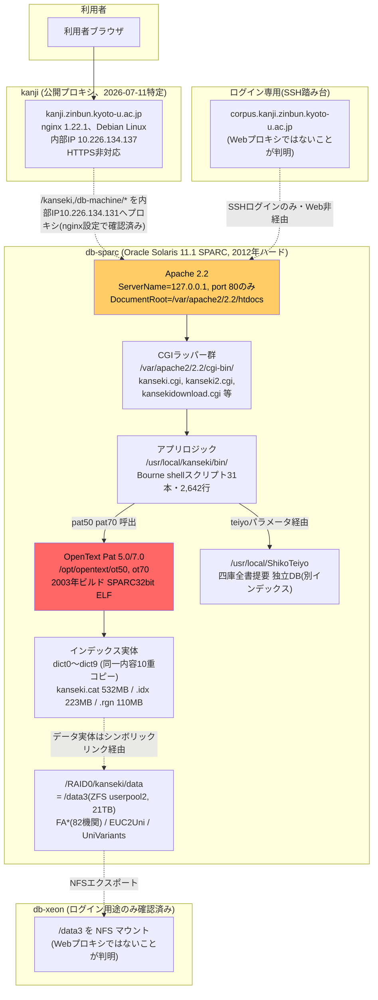
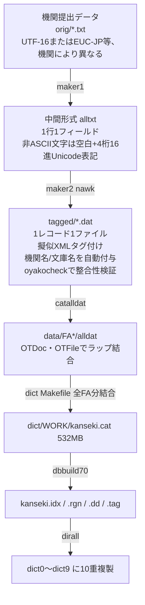
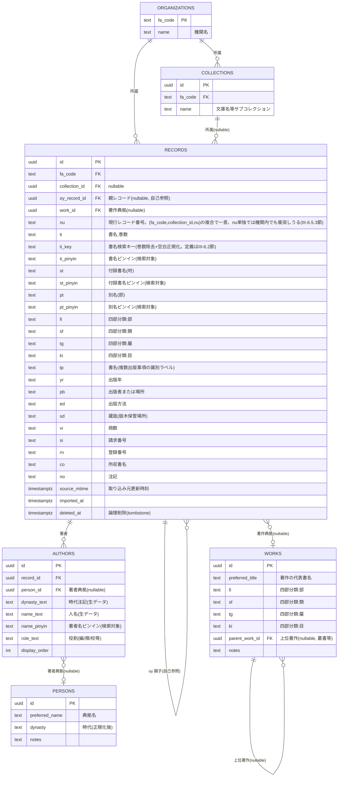
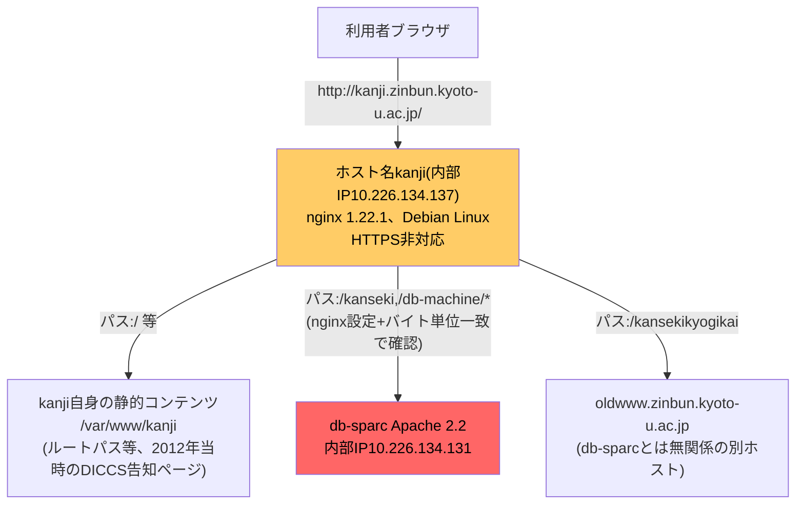

# 全国漢籍データベース 再開発プロジェクト 全体まとめ

作成・更新: 2026-07-09〜2026-07-11（依頼者との会話を通じて継続更新）

本ドキュメントは、現状把握・再開発案の検討過程で作成した調査・検討内容を1つに統合したものである（2026-07-11、依頼者の指示によりdocs/配下の個別ドキュメントを本ファイルに一本化）。

- **第I部 現状把握** — 現行db-sparcシステムの全容調査
- **第II部 再開発案** — スコープ・技術スタック・移行計画の決定事項
- **第III部 データモデル再検討** — 書誌データモデルの設計
- **第IV部 現行サイト実地調査** — 公開URLへの実地アクセス検証・公開プロキシサーバーへのSSH調査（2026-07-11実施）

関連資料: [`refs/tag-list.md`](../refs/tag-list.md)（タグ意味の一次資料、出典: [京都大学学術情報リポジトリ](https://repository.kulib.kyoto-u.ac.jp/dspace/handle/2433/65024)）、`survey/`（db-sparcから取得した現物資料一式）、[`CLAUDE.md`](../CLAUDE.md)（本リポジトリでの作業ガイド）

---

# 第I部: 現状把握

調査対象: db-sparc（本番稼働中サーバー、読み取り専用調査）

## I-1. エグゼクティブサマリ

全国漢籍データベースは、京都大学人文科学研究所が運営する、全国82機関（`data/FA*`ディレクトリの実数。予備調査時点の「91機関」という数値は2026-07-11の実地検証で誤りと判明）が参加する漢籍（中国古典籍）書誌データベースである。現行システムは技術的に**再開発が急務**な状態にある。

### 再開発が必要な理由

| 要因 | 現状 | リスク |
|---|---|---|
| ハードウェア | Oracle Solaris 11.1 SPARC（2012年ビルド、富士通SPARC機） | SPARCサーバーは新規調達が事実上不可能。故障時に同等機での交換ができない |
| 検索エンジン | OpenText Pat 5.0/7.0（2003年ビルドのSPARC 32bit ELFバイナリ） | ソース・ライセンス入手不可、開発元(OpenText)のサポート終了、x86/ARM移植不可。**再開発では検索エンジンの完全置き換えが必須** |
| Webサーバ | Apache 2.2（EOL済み。2018年に公式サポート終了） | 既知の脆弱性が修正されない |
| 通信 | HTTPS非対応（ポート80のみ） | 平文通信、現代のブラウザ・検索エンジンからの信頼性低下 |
| ロジック | Bourne shellスクリプト31本・計2,642行の密結合実装（1990〜2020年代にわたる継ぎ足し） | 保守できる技術者が限られる。仕様書が存在せず、コードが仕様そのものになっている |
| 運用監視 | Apacheのアクセスログが無効化されている（`CustomLog`がコメントアウト） | 利用実態（検索頻度・人気機関・障害箇所）が把握できない |
| 冗長化 | OpenTextインデックスを`dict0`〜`dict9`として同一内容を10重コピー（同時アクセス制約回避のためと推測） | 本質的な同時実行制御ではなく、力技の回避策。更新のたびに10箇所への複製が必要 |

一方で、次の点は現行システムの**資産**として再開発に引き継ぐべきである。
- 82機関・198万件の書誌データと、その中に埋め込まれた外字・異体字処理のノウハウ
- 叢書の親子構造（oy/ko）や機関ごとの所蔵記号（si）など、長年の運用で磨かれたデータモデル
- 機関側の入力ツール「漢籍レコードエディタ(Kanseki Editor)」による確立された投入フロー

### 依頼者からの確認事項（2026-07-09）

初版調査で「要確認」としていた論点について、依頼者（京都大学人文科学研究所側）から得た回答:

| 論点 | 回答 |
|---|---|
| `corpus.kanji.zinbun.kyoto-u.ac.jp`とdb-xeonの役割 | **ログイン（SSH踏み台）用途のみ**。実際のWebリバースプロキシは、これらとは別の未特定サーバーが担っている |
| `db-machine`という内部パス名の実体 | **db-sparc自身**を指す内部エイリアス（別ホストではない） |
| `kansekitenkyo`(`data/FA002735`,`FA019705`の`tenkyo/`ディレクトリ)の目的 | 依頼者側でも**不明**（現役担当者への確認が必要な事項として残る） |

これにより、公開Webアクセスの実際のリバースプロキシ／TLS終端サーバーは**依然として未特定**であることが判明した。

### 実地調査による解決（2026-07-11、第IV部参照）

公開URL(`http://kanji.zinbun.kyoto-u.ac.jp/kanseki`)への実際のHTTPリクエスト検証、および**依頼者提供のSSHログイン情報による公開プロキシサーバー自体への直接調査**により、長年「要確認」だったこの論点は**完全に解決した**。

- 公開窓口の実体は**ホスト名`kanji`（`kanji.zinbun.kyoto-u.ac.jp`、Debian Linux、nginx 1.22.1）**、内部IPは`10.226.134.137`。この内部IPは、db-sparcのApache error_logに一貫して記録されていた唯一のクライアントIPと完全に一致し、証拠として確定した
- nginxの設定ファイル(`/etc/nginx/sites-enabled/default`)を直接確認し、`/kanseki`と`/db-machine/*`が**db-sparc（内部IP`10.226.134.131`）へリバースプロキシ**されていることを設定レベルで確認（`/db-machine/`のレスポンスがdb-sparc上の`/var/apache2/2.2/htdocs/index.html`とバイト単位で完全一致することも既に確認済み）
- ルートパス`/`は、kanjiサーバー自身の`/var/www/kanji`から静的コンテンツ（2012年当時の京大人文研旧告知ページ）を配信している
- **新発見**: `/kansekikyogikai`（全国漢籍データベース協議会ページ）はdb-sparcとは無関係の別ホスト`oldwww.zinbun.kyoto-u.ac.jp`にプロキシされている
- **新発見**: `corpus.kanji.zinbun.kyoto-u.ac.jp`経由でHTTPS化する代替プロキシ設定がコメントアウトされた状態で存在する（現在無効、要確認: 移行計画の現状）
- **新発見**: `/kanseki`エンドポイントには1,241件のCIDRブロックリスト(`ddos.deny`)による悪用対策が既に実施されている
- **重要な訂正**: このkanjiサーバーでは**nginxのアクセスログが実際に有効**になっている（14日分ローテーション保持）。ただし現在のSSH権限では読み取れない（要`adm`グループ権限）。db-sparc側のApacheログが無効という事実に変わりはないが、「利用実態を把握する手段が全くない」という従来の結論は修正が必要（I-8.2節・技術的リスク一覧参照）

### 残存する要確認事項

- `kansekitenkyo`の目的・生成元（依頼者側でも不明）
- corpus経由のHTTPS化プロキシ設定が無効化されている理由・今後の予定
- nginxアクセスログへの読み取り権限取得の要否
- ~~全91機関中1機関(FA001379)のみのサンプリングでは`maker1`の機関差異を代表できない~~ → **解消（2026-07-11）**: I-11章に記載の検証プランをフェーズ1まで実施し、全82機関・121コレクションの`maker1`/`maker2`ハッシュ分類を完了

---

## I-2. システム構成図



### 更新パイプライン構成図



---

## I-3. データモデル

### I-3.1 規模

- レコード数: 1,984,690件（`OTDoc`/`OTFile`リージョンのカウント値と一致）
- 参加機関数: 82（`data/FA*`ディレクトリの実数を2026-07-11に確認。`FA`コードはNACSIS/NIIの機関コードに準拠するもの以外に、`FAASHIKAGA`等の英字コードも存在）
- 1機関が複数コレクションを持つ例あり（例: `FA001379`東北大学は`orig`（本館所蔵）と`origKanaya`（金谷文庫）の2コレクション）
- インデックス実体は`dict.cat`(532MB) / `.idx`(223MB) / `.rgn`(110MB)で、これを`dict0`〜`dict9`として同一内容を10重複製

### I-3.2 レコード構造（タグ一覧）

サンプル(`FA001379/tagged/0039010.dat`, `0039011.dat`, `0039012.dat`)とアプリスクリプトの精読に加え、依頼者提供の一次資料 [`refs/tag-list.md`](../refs/tag-list.md)（出典: [京都大学学術情報リポジトリ](https://repository.kulib.kyoto-u.ac.jp/dspace/handle/2433/65024)）により、全タグの意味を**確定**させた。以前「推定」としていた`fi`/`sf`/`tg`/`ki`、および誤って推定していた`st`/`pt`をこの一次資料に基づき訂正済み。

| タグ | 意味 | 備考 |
|---|---|---|
| `<nu>` | レコード番号(ファイル名と一致) | maker2が"nu:"行から生成 |
| `<oy>` | 子目からの逆リンク（親レコード番号） | 叢書の子項目のみ持つ |
| `<ko>` | 子目へのリンク（子レコード番号、複数可） | 親（叢書代表）レコードが子の数だけ`<ko>`を列挙 |
| `<co>` | 所収書名 | `oy`/`ko`の親子リンクとは異なる概念（`tag-list.md`の注記）。例:「通志堂経解 第一・二冊」。record画面で親タイトルとの重複部分を差分表示する処理あり |
| `<fi>` | 四部分類の「部」（経/史/子/集） | 親レコードにのみ出現。`fi→sf→tg→ki`という4階層構造の最上位。実データ集計（I-3.2.1節）では大多数が経/史/子/集＋叢書部/雜部の6値に収まるが、機関独自ラベルの混在もあり |
| `<sf>` | 四部分類の「類」 | `fi`の下位区分。伝統的な四庫分類の類名（別集類・地理類等）が大多数 |
| `<tg>` | 四部分類の「屬」 | `sf`の下位区分（例:「今地志之屬」「異聞之屬」） |
| `<ki>` | 四部分類の「目」 | `tg`の下位区分（最下位）。**語彙は上位区分に依存**し、例えば別集類系統では王朝名（明/宋/唐等）、地理類系統では省名（浙江/江蘇等）が入る、文脈依存の分類 |
| `<ti><key>...</key>...</ti>` | 書名, 巻数（例:「尚書註疏,二十卷」。`<key>`はソート・検索キー） | query/detailqueryの`ti`検索対象 |
| `<TI>` | 書名のピンイン | 大文字タグ＝ピンイン版という命名規則（`AU`/`ST`/`PT`も同様） |
| `<st>` | 付録書名（坿・付属して収録される別著作の書名） | 「叢書名」ではない（旧版の誤り）。表示時にラベルを付与(record/title/querytitle) |
| `<ST>` | 付録書名のピンイン | |
| `<pt>` | 別名（即・当該書の別称/異称） | 「部分類」ではない（旧版の誤り）。表示時にラベルを付与 |
| `<PT>` | 別名のピンイン | |
| `<au>` | 著者（年代, 著者名, 貢献の順。例:「漢,孔安國,傳」） | key前=年代（王朝等）、key後=貢献（編/撰/校等の役割） |
| `<AU>` | 著者名のピンイン（年代・貢献は含まない） | |
| `<tp>` | 書名（複数の出版事項がある場合に、どの出版事項がどの書名に対応するかを示すラベル） | |
| `<yr>` | 出版年 | |
| `<pb>` | 出版者または場所 | |
| `<ed>` | 出版方法（冊子等の形態） | |
| `<sd>` | 蔵版（版木の所蔵・保管場所） | 旧版では「補助的な年代等」と誤って推定していた |
| `<vi>` | 冊数 | 表示時に単位（冊/帖等）を後置する特殊処理あり |
| `<si>` | 請求番号 | 親子で同一の場合は子側で非表示にする`checksi`ロジックあり |
| `<rn>` | 登録番号 | 旧版では未確認だったタグ |
| `<or>` | 所属機関（所蔵機関名） | maker2が機関ごとにハードコードした値を**全レコードに**自動付与(次レコード開始時 or ファイル末尾) |
| `<se>` | 文庫名 | 例: 東北大学「金谷文庫」。レコード自身が`<se>`を持たない場合のみmaker2既定値を補完 |
| `<no>` | 注記（コンマをnbspに変換して表示） | |
| `<pinyin><ti\|au\|st\|pt>...</pinyin>` | `TI`/`AU`/`ST`/`PT`と同義のピンインラッパー表現 | **検索インデックスには含まれず**(kanseki.tagに`pinyin`リージョンなし)、`txt`(全文閲覧、3機関限定)でのみ大文字タグとして表示に使用 |

**複数出現可能なタグ**（`tag-list.md`より）: `ko`, `au`/`AU`, `ti`/`TI`, `st`/`ST`, `pt`/`PT`, `tp`, `yr`, `pb`, `ed`, `rn`, `no`（数値サフィックス`au2`,`ti3`等で複数管理、`maker2`の解析ロジックと対応）

#### I-3.2.1 四部分類(`fi`/`sf`/`tg`/`ki`)の実データ集計（2026-07-11実施）

全82機関の`alldat`から`fi`/`sf`/`tg`/`ki`の実際の出現値を集計した結果（`survey/classcodes_decoded.txt`に集計結果を保存）、以下が判明した。

- `fi`は2,819種類の異なる文字列が存在するが、上位6種（經部/史部/子部/集部/叢書部/雜部、合計約94%）で大半を占める。残りのロングテールには、**日本十進分類法(NDC)のコード**（例:「222 中国史」「921 詩歌・韻文・詩文」）を流用した機関、`&nbsp;`などのHTMLエンティティが残存した値、明らかな入力ミス・表記揺れ（「總集類」/「総集類」等）、未変換のgaiji（生の16進コードポイントがそのまま残っている行が434件）が混在する
- `sf`は612種、`tg`は936種、`ki`は1,122種の異なる値があり、**単一の統制語彙表ではなく、機関ごとの目録実務の集積**であることが確認された
- したがって「四部分類の正式なコード値一覧」という単一のマスタは実データ上は存在せず、**新システムでもこれらのフィールドは当面フリーテキストとして扱い、正規化・クレンジングは別途データ品質改善プロジェクトとして切り出すのが現実的**（第III部6.4節で詳述）

### I-3.3 親子構造（oy/ko）

叢書（複数巻からなる出版物のまとまり）は「親レコード（叢書代表）」と「子レコード（個別書物）」に分割して格納される。
- 親は`<ko>`子番号を子の数だけ列挙（`0039010.dat`は153行中145個の`<ko>`を保持）
- 子は`<oy>`親番号を1つ持ち、親情報にリンク
- 整合性検証: `oyakocheck`スクリプトが、`oy`⇔`ko`の双方向リンクの矛盾（片方向のみのリンク、重複)を検出する。機関データ取り込みの都度実行される
- 検索結果の表示（`checkoya`/`traceoya`）では、子レコードがヒットした場合に親を遡って表示し、detailqueryのNOT条件では`traceoya`で子を親に丸め込んでから集合演算を行う

### I-3.4 OpenTextインデックスのリージョン定義（`kanseki.dd`より）

| リージョン名 | 件数 |
|---|---|
| OTDoc / OTFile | 各1,984,690 |
| key | 8,877,218 |
| ti | 4,472,172 |
| au | 4,121,840 |
| ed | 752,506 |
| yr | 477,904 |
| pb | 290,896 |
| st | 228,220 |
| pt | 54,982 |
| oy | 1,478,588 |
| ko | 1,478,344 |
| si | 1,193,192 |

予備調査の推定値と実測値（`kanseki.dd`）は完全に一致した。

---

## I-4. 検索機能仕様

全ての機能は単一のCGIラッパー`kanseki.cgi`(=`kanseki`スクリプト)を経由し、`QUERY_STRING`のパラメータで分岐する。`kanseki2.cgi`はURL変数のみ書き換えた新版で、移行の形跡と見られる（動作は同一）。

### I-4.1 エンドポイント一覧（`kanseki`スクリプトのcase分岐）

| QUERY_STRINGパターン | 処理 | 内容 |
|---|---|---|
| `jpg=data/....jpg` | `jpg` | 書影画像(JPEG)をそのまま返却。パスに`.`を含む場合は拒否(パストラバーサル対策) |
| `txt=data/FA019705(or FA002735/FA011962)/....dat` | `txtmain`→`txt` | **3機関限定**でタグ付き全文をプレーンテキスト表示 |
| `ver=` | `version` | 漢籍レコードエディタの最新版へリダイレクト |
| `teiyo=...` | `shikoteiyo` | 四庫全書提要DB(別インデックス)を検索 |
| `download` | `download` | 漢籍レコードエディタのダウンロードページへリダイレクト |
| `back=-*` / `back=[3-999]...` | `toppage` | 戻る回数指定でトップページへ |
| `query=...` | `query` | 簡易検索（`key`リージョンへの1条件全文検索、AND/OR/NOT対応） |
| `record=data/....dat` | `record` | 書誌詳細表示（親子構造・画像・関連リンクを含む） |
| `detail&...` | `detail`(→`detailpage`) | 詳細検索フォーム表示 |
| `tips&` | `tips` | 検索のコツ(FAQ)。機関一覧セレクトボックスを動的生成 |
| `ti=...&au=...&yr=...&pb=...&fr=...&ko=...&or=...` | `detailquery` | 詳細検索（複数フィールドAND/OR/NOT、`ko`は子目名の横断検索＋親への遡及、`or`は機関フィルタ） |
| 上記いずれでもない | `toppage` | トップページ |

全出力は最後に`makeheader`（HTTPヘッダ＋`makeutf8`によるUTF-8変換）を通す。

### I-4.2 検索クエリ言語（Pat 5.0/7.0 region構文）の使われ方

- 簡易検索(`query`)は`key`リージョンに対する1条件検索のみ。入力文字列は4桁16進Unicode（"%XX%XX" URLエンコードされたUTF-8バイト列から復元）に変換され、`"XXXX" fby "key"`（完全一致）または`( "XXXX1"+"XXXX2"+"XXXX3"+"XXXX4" )`（前方一致許容、字種のゆれを吸収）の形で`region key including`条件を構築
- 詳細検索(`detailquery`)は`ti`/`au`/`yr`/`pb`/`fr`をそれぞれ独立にクエリ化し、`{Proximity 7}`のPat演算子で`region OTDoc`単位にAND/OR/NOT結合。`ti`は`(region ti+region st+region pt) including key`、`au`は`region au including key`という形で対象リージョンを絞り込む
- **異体字統合**: 完全一致でない検索では、入力文字コードを`data/UniVariants`（8,814件の異体字対応表、例:`4E1C: 6771`=「东→東」）で展開し、異体字をOR結合した上でPatクエリに埋め込む。これにより、データ本体の文字を書き換えずに検索時のみ異体字を統合している
- `ko`（子目検索）は`ti`/`st`/`pt`リージョンを機関横断で検索した後、`traceoya`で親レコードに丸め込み、NOT条件時は「`oy`を含まないOTDoc（＝親のみ）」との集合演算(`comm`)を行う
- `or`（機関フィルタ）はPatクエリではなく、結果ファイルパスに対する`fgrep data/<FA番号>/`によるポストフィルタ

### I-4.3 詳細検索フォームの項目（`detailpage`より）

`ti`(書名)、`au`(著者名)、`yr`(刊年)、`pb`(出版者)、`ko`(子目)、`fr`(keyword)、`or`(所蔵機関、複数選択)

### I-4.4 画面UI詳細（実地確認、2026-07-11、IV-3章参照）

各画面のボタン・リンク・表示要素を実際にアクセスして確認した。新システム設計への影響が大きい点のみ抜粋:

- **トップページの検索フォームには送信ボタンが無く**、Enterキー送信のみに依存している（詳細検索フォームには明示的な「檢索」ボタンがある）
- **検索結果一覧にページネーション機構が無い**。ヒット件数に関わらず全件を1ページに出力する設計
- **`record=`ページのソースには、生の`tagged/*.dat`データが全機関・全レコードでHTMLコメントとして埋め込まれている**。これは`txt=`エンドポイントの3機関限定制限とは独立しており、実質的に全レコードの内部タグ構造（画面非表示のフィールドも含む）が誰でも閲覧可能な状態にある
- 書影画像(`jpg=`)・外部リンク(EUC2Uni経由でオンザフライ変換される`link`ファイル)は実データで動作を確認済み
- 「戻る」リンクは`back`パラメータの値に応じて、単純な`<A HREF>`版とJavaScript(`history.go`)版を使い分ける
- **サイト全体で旧字体表記（檢索・畫面・戾る等）が一貫して使われている**。新システムでの表記方針（維持 or 現代化）は要検討事項

---

## I-5. 文字コード・外字処理の仕様

これが本データベースの核心部分であり、再開発において最も慎重な設計が必要な領域である。

### I-5.1 シェルスクリプト内部でのUnicode表現規約

全てのCGIスクリプトは、日本語・漢字テキストをソースコード上で直接記述せず、**「半角スペース＋4桁(まれに5桁)16進Unicodeコードポイント」**の並びとして埋め込んでいる。

```
echo $1 30ec 30b3 30fc 30c9 898b 3064 304b 308a 307e 3057 305f
```
は「◯件レコード見つかりました」を意味する（30ec=レ, 30b3=コ, 30fc=ー, 30c9=ド, ...）。

この記法は最終的に`makeutf8`（`bin/makeutf8`, nawkスクリプト）によってUTF-8バイト列に変換される。`makeheader`が全出力の末尾でこれを呼び出す。この設計により、Bourne shellスクリプト自体は完全にASCIIのみで構成され、エディタやOS間の文字コード差異によるソース破損を防いでいる。**tagged/*.dat内のデータ本体も同じ規約（非ASCII文字は"スペース+16進コード"）で格納されている**（サンプル`0039010.dat`等で確認済み）。

### I-5.2 機関データの取り込み時エンコーディング変換

- `maker1`（機関ごとにカスタマイズされたシェルスクリプト）が、機関提出の`orig/*.txt`を`od -xv`でバイトダンプし、2バイト単位（UCS-2/UTF-16相当）で処理。BOM(`feff`)除去、サロゲートペア結合（`d800-dfff`範囲の高位・下位サロゲートを1コードポイントに合成）、全角スペース(`3000`)・半角スペース(`0020`)の`&nbsp;`変換、特定の記号（水平線`2015`→ハイフン、間隔点`2027`→中点`30fb`）の正規化を行う。サンプル(`FA001379`)ではUTF-16ベースの処理を確認
- `EUC2Uni`（6,879件、EUC-JP 2バイトコード→Unicode変換表）は、旧来のEUC-JP系データや、`record`/`tips`等で外部リンクテキストをオンザフライ変換する際に使用
- **`maker1`の機関差異検証結果（2026-07-11実施、I-11章参照）**: 全82機関・121コレクションの`maker1`/`maker2`を`digest -a md5`でハッシュ分類した結果、以下の3パターンに分類された
  1. **標準テンプレート（118/121コレクション、97.5%）**: `maker1`が完全に同一ハッシュ。Kanseki Editorが出力するUTF-16形式をそのまま前提とする処理（FA001379で確認した内容と同一）。`maker2`のみ機関ごとに異なる（`shozo`/`se`のハードコード値の違い）
  2. **UTF-8入力対応の軽微な変種（1コレクション、FA002655）**: 標準の`maker1`に対し`od -xv $FILE`の前段に`iconv -f utf-8 -t utf-16le`を1行追加しただけの差分。**当初懸念していたEUC-JP系の生データ提出は、実際にはほぼ存在しなかった**
  3. **完全に独立したパイプライン（FA011962の2コレクション: `orig`,`origKuraishi`）**: 標準の`maker1`/`maker2`が存在せず、`Big5Uni`(Big5→Unicode変換表)・`Daikanwa`(大漢和辞典番号)・`makerdat`/`makeriso`/`maketree`/`gaijiexpand`等の独自ツール群からなる別体系。ファイル名（`inoue.txt`, `tobunken-kuraishi.txt`等）や大容量のテキストファイルから、既存の大規模漢籍全文コーパスを別途統合したものと推測される。I-8章で確認した「`txt`エンドポイントが`FA019705`/`FA002735`/`FA011962`の3機関限定」という制限は、この特殊なデータ系統に由来すると考えられる（引き続き要確認: 具体的な来歴）

  結論: **機関ごとのデータ提出エンコーディングのばらつきは、当初想定したより遥かに小さい**。なお第II部1章の決定通り、機関データ投入フロー（`maker1`/`maker2`）自体は現行維持であり、新システムの定期インポーターは`tagged/*.dat`（タグ構造は機関を問わず統一。ただし非ASCII文字は「スペース+16進コード」表記のままでUTF-8化はされていない、II-6.1節で訂正）のみを読むため、この`maker1`側の差異を新システムが直接意識する必要はない。この調査結果は、(a)現行パイプラインの保守リスクが想定より低いことの裏付け、(b)将来的にデータ投入フロー自体を刷新する場合の参考情報、として価値がある
- `maker2`（nawkスクリプト）が中間形式`alltxt`を1行1フィールドとして解析し、`<ti>`/`<au>`/`<pinyin>`等のXML類似タグに変換して`tagged/*.dat`を生成。**機関名(`<or>`)・文庫名(`<se>`)はmaker2内にハードコードされ、レコード自身が明示的に持たない場合の既定値として補完される**（`FA001379/orig/maker2`は`shozo="東北大"`固定、`origKanaya/maker2`は既定`<se>`="金谷文庫"を追加するなど、コレクションごとに`maker2`自体を複製・改変して運用している）

### I-5.3 外字・異体字の統合的な扱い

| 変換表/ツール | 役割 |
|---|---|
| `data/EUC2Uni` | EUC-JP 2バイトコード → Unicodeコードポイントの単純対応表(6,879件) |
| `data/UniVariants` | 「ある文字」と「その異体字群」のUnicode対応表(8,814件)。**検索時にのみ**異体字をOR展開する目的で使用し、データ本体は書き換えない |
| `bin/makeutf8` | "スペース+16進コード"表記 → UTF-8バイト列（BMP外は4バイトUTF-8まで対応、`t<2097152`すなわちU+1FFFFFまで） |
| `bin/utf8ucs2` | UTF-8テキスト → UCS-2相当のuuencode形式（非BMP文字は`&x1234;`のような数値実体参照として保持） |
| `bin/reshapenu` | UCS-2/UTF-16バイナリファイル → od出力の再整形（改行コード正規化: CR/LF/CRLFゆれの検出） |
| `bin/checkcrlf` | 改行コードの不整合検出(CR-CR、LF追加等をstderrへ警告) |

非BMP文字（拡張漢字・gaiji/外字）はUnicodeの補助面コードポイントとして扱われており、専用の外字フォント・独自コード体系（機関固有の外字番号等）は本調査の範囲では確認されなかった。ただし全機関の投入データを網羅的に調査したわけではないため、機関固有の外字運用が別途存在する可能性は残る（要確認）。

---

## I-6. データ更新運用フロー

### I-6.1 機関からの新規データ受領〜反映

1. 参加機関が「漢籍レコードエディタ(Kanseki Editor)」というWindows向けツール（`/usr/local/kanseki/editor/`で配布、`kansekieditor1.00.lzh`〜`1.04.zip`の版が存在）を用いてデータを作成し、`orig/*.txt`として提出
2. 機関ディレクトリの`Makefile`（例:`data/FA001379/orig/Makefile`）を`make`すると
   - `maker1 *.txt > alltxt` : 生データを中間形式に変換
   - `maker2 alltxt` : `tagged/*.dat`（1レコード1ファイル）を生成。既存ファイルのうち更新されなかったものは削除（`find ... ! -newer alltxt -exec rm`）
   - `oyakocheck` : oy/ko整合性チェック（結果は標準出力、自動修正はしない）
3. `dict/Makefile`を`make`すると
   - 各機関の`catalldat`が`tagged/*.dat`を`alldat`（`OTDoc`/`OTFile`タグでラップ結合）に集約。**`alldat`より新しい`.dat`が無ければ再生成をスキップするキャッシュ機構**あり
   - 全機関の`alldat`を`kanseki.cat`に結合
   - `dbbuild70`（`ddgen70`→`ipfinder70`→`patbld70`→`findtags70`→`multirgn70`の内部呼び出し）でインデックス(`kanseki.idx`/`.rgn`)を生成
   - `dirall`で`dict0`〜`dict9`に複製

**実際に2026年7月1日にインデックスが更新されており、このパイプラインは現役で運用中**であることを確認した。

### I-6.2 実際の更新頻度・トリガー方法の調査（2026-07-11実施）

パイプラインが**手動トリガーか自動（cron等）か**、また**実際の更新頻度**を、以下の方法で調査した。

- `crontab -l`（自ユーザー、および`yasuoka`ユーザーはsudoなしのため不可）を確認したところ、少なくとも自ユーザーには何も登録がない。`/var/spool/cron/crontabs/`には`adm`/`fjse`/`root`/`sys`のみ存在し、**`yasuoka`名義のcrontabは存在しない**（パイプラインの実行主体と目される本人にcronジョブがないことから、手動実行の可能性が高い）
- `root`のcrontabは`sudo`なしでは読めず内容不明（要確認として残存）。SMFサービス一覧(`svcs -a`)にも`kanseki`関連のサービスは見当たらない
- Solarisのcron実行ログ(`/var/cron/log`)はroot権限がないと読めず、実行履歴は確認できなかった
- 代わりに**全82機関の`alldat`ファイルの更新時刻を実地調査**したところ、明確なパターンが見えた:
  - 2026年1月30日〜3月10日にかけて、ほぼ全機関の`alldat`が数秒〜数日おきに**機関コード順とみられる順序で連続的に再生成**されている（一括再生成キャンペーンと推測される）
  - その後は 2026年5月15日(FA001980)・5月25日(FATOYO)・6月5日(FA019705)・7月1日(FAHOUSA) と、**単一機関ずつ、2〜4週間に1回程度の不定期な間隔**で更新されている
  - `dict/kanseki.idx`等インデックス本体の最終更新（7月1日17:25〜17:30）は、`FAHOUSA/alldat`の更新時刻（7月1日17:26:11）とほぼ同時刻であり、**いずれか1機関のデータが更新されるたびに、全82機関・約198万件分のインデックスを毎回フルリビルドしている**ことが確認できた（`dict/Makefile`の実装上、`kanseki.cat`は全機関の`alldat`を結合して作るため、差分ビルドの仕組みがない）

**結論**: 更新は固定スケジュールのcronではなく、**新規データが届いた際に手動（おそらく`yasuoka`氏による）でパイプラインを実行している**可能性が高い。直近の実運用頻度は月1回程度だが、まとまったデータ整備時には数日おきに連続実行されることもある。OpenText Patには差分インデックス機構がなく、**1件でも更新があれば全件フルリビルドが必要**という制約が、この運用頻度にも影響していると考えられる。

### I-6.3 レガシーな痕跡

- `/usr/local/kanseki/index70/`と`mkindex70.sh`は`/RAID4/kanseki/...`という現在は存在しないパスを参照しており、2007年当時の旧ビルド手順の残骸と判断される（現行の`dict/Makefile`ベースの手順とは別物）
- `bin.new`という新版アプリ用ディレクトリへのCGIシンボリックリンク(`kansekinew.cgi`)が存在するが、リンク先(`/usr/local/kanseki/bin.new/`)は実体が存在しない**壊れたリンク**。過去に何らかの移行が試みられ中断したものと推測される（要確認）
- `origKanaya`のように、1機関内に複数の`orig*`/`tagged*`ディレクトリ・専用`maker2`を持つコレクションが存在し、機関側の追加提出のたびに`maker2`を複製・改変して運用してきたと考えられる

---

## I-7. 外部依存関係

| 依存先 | 関係 | 詳細 |
|---|---|---|
| **四庫全書提要DB (`/usr/local/ShikoTeiyo`)** | `kanseki.cgi`の`&teiyo=`パラメータから`bin/shikoteiyo`経由で呼び出し | 独立したOpenText Pat 7.0インデックス(`shikoteiyo.dd`)を保持し、漢籍DBのメインインデックスとは完全に別系統。検索結果はShikoTeiyo側の静的`index.html`をパースして絞り込み表示するという結合度の高い実装 |
| **漢籍レコードエディタ配布ページ** (`htdocs`内`kansekieditor`シンボリックリンク) | `bin/download`, `bin/version`からリダイレクト | 機関がデータ入力に使うWindows向けツール本体を配布。データ投入フローの起点 |
| **corpus.kanji.zinbun.kyoto-u.ac.jp** | `kanseki2.cgi`のURL変数、および本調査で使用した踏み台サーバーそのもの | **依頼者確認済み(2026-07-09)**: SSHログイン用途のみで、Webリバースプロキシではない。実際の公開Webプロキシは**`kanji`サーバー**であることを2026-07-11に確定（下記）。ただしnginx設定には「corpus経由・HTTPS化」というコメントアウトされた代替パスがあり、将来の移行計画の痕跡である可能性がある（要確認） |
| **kanji.zinbun.kyoto-u.ac.jp（ホスト名`kanji`）** | 公開Webプロキシ本体。SSHログインにより2026-07-11確定 | nginx 1.22.1(Debian Linux)。内部IP`10.226.134.137`からdb-sparc(`10.226.134.131`)の`/kanseki`・`/db-machine/*`等へリバースプロキシ。`coe21.zinbun.kyoto-u.ac.jp`等、他の研究所サイトも同居する共用サーバー。アクセスログは有効(要権限)。詳細はIV-0章 |
| **db-xeon** | `/data3`をNFSエクスポート | **依頼者確認済み(2026-07-09)**: ログイン用途のみで、Webリバースプロキシではない |
| **`db-machine`という内部パス名** | `download`/`kansekilist`等のリダイレクト先URLや、Apache error_logのreferer(`.../db-machine/~yasuoka/...`)に頻出 | **依頼者確認済み(2026-07-09)**: db-sparc自身を指す内部エイリアスであり、別ホストではない |
| **kansekitenkyo** (`data/FA002735(FA019705)/tenkyo/*.htm`) | `htdocs/kansekitenkyo`から特定2機関のみ静的HTMLとして公開 | 個別書誌の詳細解題（提要）と見られる補足ページ。**依頼者側でも目的不明**（2026-07-09確認）。生成元・更新頻度とも未詳のまま、現役担当者への確認が必要 |
| **kansekilist / kansekilist2** | 独立CGI。`FA019705`(内閣文庫相当と推測される大規模機関)および`FA002735`専用の、経史子集分類ベースのブラウジングUI | メイン検索とは別に、請求記号(`si`)先頭の分類コードをハードコードテーブルで解釈し階層表示する特殊機能。汎用性がなく機関固有 |
| **kanseki-tokyo2024.cgi** | 命名が類似するのみで**漢籍DB本体とは無関係** | 「第19回TOKYO漢籍SEMINAR」の受講申込フォーム(sendmail送信)。現在は「定員に達した」旨のメッセージのみ返す。再開発のスコープ外と判断 |
| **saiiki, magazine.cgi等** | 同一htdocs配下に同居する別データベース群 | 漢籍DBとの直接の依存関係は確認されず、スコープ外 |

---

## I-8. アクセス制御・利用統計

### I-8.1 アクセス制御

- **メイン検索機能(`kanseki.cgi`)自体にはIPアクセス制限や認証は存在しない**（完全公開）
- `kansekidownload.cgi`（機関別の生テキストファイル一括ダウンロード用CGI）のみ、京都大学キャンパス内ネットワークからのアクセスに制限:
  - `130.54.104.*`
  - `10.226.13[2-5].*`, `10.226.15[5-9].*`, `10.226.160.*`（北白川地区）
  - `10.229.23[6-9].*`（吉田北 WaveLAN）
  - `10.229.14.*`（吉田北・図書室）
  - `10.232.68.*`（附属図書館）
- `bin/txt`（タグ付き全文をプレーンテキスト表示するエンドポイント）は、IP制限ではなく**データ側で`FA019705`/`FA002735`/`FA011962`の3機関のみ**に許可する形でハードコード制限されている

### I-8.2 ログ・利用統計

- Apache `httpd.conf`では`CustomLog`（アクセスログ）ディレクティブが**コメントアウトされており、有効化されていない**。したがってdb-sparc単体では検索クエリ・利用頻度等の統計を得る手段が存在しない
- `ErrorLog`は`rotatelogs`で週次ローテーションされており(`/var/apache2/2.2/logs/error_log.<epoch>`)、約19週分が保持されている。内容は主に404/スクリプト欠落エラーで、利用統計としては使えない
- 調査時点のerror_logで観測されたクライアントIPは一貫して`10.226.134.137`のみであった。**2026-07-11の実地調査でこのIPが公開プロキシサーバー`kanji`自身の内部IPであることが確定した**（外部依存関係I-7章参照）
- **2026-07-11判明**: `kanji`サーバー側のnginxでは**アクセスログが実際に有効**になっており(`/var/log/nginx/access.log`等、14日分保持)、db-sparc側にはない検索クエリ・トラフィックの記録が存在する可能性が高い。現在のSSH権限(`adm`グループ非所属)では読み取れないため、内容は未確認
- ディスク容量に起因すると見られるエラー（`Output file write error --- outof disk space?`）がerror_log中に記録されていたが、**2026-07-11にdf/zfs listで実地確認した結果、db-sparc・kanjiサーバーとも容量に十分な余裕がある**ことを確認した（db-sparcの主データ領域`userpool2/data3`は46%使用・24TB空き、kanjiサーバーのrootは5%使用）。error_log中のエラーは過去の一時的事象と考えられる

---

## I-9. 技術的リスク一覧

| # | リスク | 深刻度 | 備考 |
|---|---|---|---|
| 1 | 検索エンジンOpenText Pat 5.0/7.0がSPARC32bit専用バイナリでソース・ライセンス入手不可 | 致命的 | ハードウェア故障=サービス停止。再開発の最大の技術的動機 |
| 2 | ハードウェア(SPARC, 2012年製)の代替調達不可 | 致命的 | 修理不能な単一障害点 |
| ~~3~~ | ~~HTTPS非対応~~ | 低〜中（要訂正） | **2026-07-11判明**: 正式な公開URL(`kanji.zinbun.kyoto-u.ac.jp/kanseki`)はHTTPS非対応のままだが、`https://corpus.kanji.zinbun.kyoto-u.ac.jp/db-machine/cgi-bin/kanseki2.cgi`という**別経路で、有効なLet's Encrypt証明書によるHTTPSアクセスが既に機能している**ことを実地確認した（IV-6章参照）。「HTTPS非対応」ではなく「正式URLがHTTPS化されていない」が正確 |
| 4 | Apache 2.2 (EOL) | 高 | 既知脆弱性への対応不可 |
| 5 | db-sparc(Apache)のアクセスログ無効化により利用実態が不明 | 低〜中（一部解消） | **2026-07-11判明**: 公開プロキシ(kanjiサーバー)側ではnginxアクセスログが実際に有効(14日分保持)。db-sparc自体のログは無効のままだが、プロキシ側ログへの読み取り権限(`adm`グループ等)が得られれば利用実態の把握は可能（IV-0.3節） |
| 6 | `bin.new`など中断した移行の痕跡 | 中 | 過去に類似の再開発が試みられ頓挫した可能性。原因の把握が望ましい(要確認) |
| 7 | ~~82機関分の`maker1`が機関ごとにカスタマイズされている可能性~~ | 低（解消） | **2026-07-11検証済み**（I-11章）: 97.5%が標準テンプレート、残り2パターンも軽微または1機関限定の特殊系統と判明。想定より小さいリスク |
| ~~8~~ | ~~ディスク容量逼迫の兆候(error_log)~~ | 解消 | **2026-07-11実地確認**: db-sparc・kanjiサーバーとも容量に十分な余裕あり（上記参照） |
| ~~9~~ | ~~実際の公開Webプロキシ/TLS終端サーバーが未特定~~ | 解消 | **2026-07-11、SSHログインにより完全解決**。ホスト名`kanji`(内部IP`10.226.134.137`)、nginx 1.22.1、db-sparc(内部IP`10.226.134.131`)への設定レベルのリバースプロキシを確認。HTTPS対応の準備はない（IV-0章） |
| 10 | 外字・異体字処理(UniVariants/EUC2Uni)がシェルスクリプトの逐次`egrep`呼び出しに依存 | 低 | 機能自体は単純だが、198万件規模でのパフォーマンス特性は現行の10重インデックス複製が示唆する通り、真剣な同時実行設計が必要 |
| 11 | 四部分類(`fi`/`sf`/`tg`/`ki`)が統制語彙になっておらず、機関ごとの表記揺れ・NDC混在・未変換gaiji(434件)がある | 低〜中 | データ移行自体には支障ないが、分類軸での検索・ブラウジング機能を新設する場合はデータクレンジングが別途必要（I-3.2.1節・第III部参照） |

---

## I-10. 再開発への論点整理（初版時点の論点。以降の決定は第II部・第III部参照）

### I-10.1 検索エンジンの置き換え

現行のOpenText Pat region検索は、次の特性を持つ。
- ドキュメント単位(`OTDoc`)を基本とし、複数の名前付きリージョン(`ti`,`au`等)への`including`条件と、`fby`(followed by)による位置関係条件を組み合わせる
- `{Proximity N}`によるトークン近接度の指定
- 完全一致/前方一致相当の切り替えが、クエリ文字列生成時（アプリ側）で作り分けられている

→ 検討の結果、第II部3章で**PostgreSQL + PGroonga**に決定。

### I-10.2 文字コード処理の刷新

- 現行の「スペース区切り16進Unicodeコードポイント」という内部表現は、Bourne shellの制約下での工夫であり、モダンな実装（UTF-8ネイティブなDB・言語）では不要になる
- ただし、**外字・異体字の統合ロジック(UniVariants)自体はデータ資産として引き継ぐべき**
- 機関ごとに異なる`maker1`（生データの文字コード変換）を、統一的な取り込みパイプラインにどう収斂させるかが論点 → I-11章で調査済み

### I-10.3 データ取り込みフローの刷新

- 機関側の「漢籍レコードエディタ」というデスクトップツールに依存した投入フローを維持するか、Web入力やCSV/Excel等への移行を提案するかは、82機関という参加規模を踏まえた合意形成が必要な論点 → 第II部1章で「当面現行維持」に決定
- `oyakocheck`のような整合性チェックを、投入時にリアルタイムでフィードバックする仕組みへ強化できる可能性

### I-10.4 インフラ構成

- corpus・db-xeonはログイン専用、実際の公開プロキシは`kanji`サーバー（nginx 1.22.1）であることが2026-07-11に確定した。新システムの公開エンドポイントは、この`kanji`サーバーの`/kanseki`ロケーション設定を更新して新バックエンドへ向け直すか、`kanji`自体を置き換えるかを検討することになる
- 現行の「同一インデックスを10重複製」という力技を、本来の同時実行制御（読み取りレプリカ、コネクションプール等）に置き換える

---

## I-11. 検証結果: 全機関`maker1`差異調査（2026-07-11実施）

初版調査ではFA001379（東北大学）1機関のみをサンプリングしていたため、他機関が同じ方式（UTF-16ベース）でデータを投入しているのか、EUC-JP系や別方式の`maker1`が存在するのかが未検証だった。フェーズ1（全機関ハッシュ分類）を実施した結果、想定より差異が小さいことが判明したため、フェーズ2以降（個別diff・生データのエンコーディング実地確認）は不要と判断し、ここで調査を完了とする。

### I-11.1 実施内容

`/RAID0/kanseki/data`配下の全`orig*`ディレクトリ（82機関・121コレクション）について、`maker1`/`maker2`の`digest -a md5`ハッシュ値を取得し分類した（ファイル内容はサーバー上で処理し、ハッシュ値のみをローカルに転送。データ転送量は無視できるレベル）。

### I-11.2 結果

| 分類 | 該当コレクション数 | 特徴 |
|---|---|---|
| 標準テンプレート | 118/121（97.5%） | `maker1`が全て完全に同一ハッシュ（`7aad01eb227283b0223494476f18182f`）。Kanseki Editorが出力する**UTF-16形式**をそのまま前提とする処理。`maker2`のみ機関ごとに異なる（`shozo`/`se`のハードコード値の違い）。うち`FA007739`の3コレクション（origHashimoto/origKasahara/origShigaku、機関名「立命館」）は`maker2`も含めて完全に同一内容だった |
| UTF-8入力対応の軽微な変種 | 1（`FA002655`） | 標準の`maker1`に対し、`od -xv`の前段に`iconv -f utf-8 -t utf-16le`を1行追加しただけの差分。生データがUTF-8で提出されている以外は標準と同じ処理 |
| 完全に独立したパイプライン | 2（`FA011962/orig`, `FA011962/origKuraishi`） | 標準の`maker1`/`maker2`が存在せず、`Big5Uni`(Big5→Unicode変換表)・`Daikanwa`(大漢和辞典番号)・`makerdat`/`makeriso`/`maketree`/`gaijiexpand`等の独自ツール群からなる別体系。ファイル名（`inoue.txt`,`tobunken-kuraishi.txt`等）や収録データの規模から、既存の大規模漢籍全文コーパスを別途統合したものと推測される |

### I-11.3 結論・示唆

- **機関ごとのデータ提出エンコーディングのばらつきは、当初想定したより遥かに小さい**。EUC-JP系データの個別対応は実質存在せず（`EUC2Uni`変換表は別用途＝`record`/`tips`等でのリンクテキストのオンザフライ変換に使われていると判明、I-5.2節参照）
- I-8章で確認した「`txt`エンドポイントが`FA019705`/`FA002735`/`FA011962`の3機関限定」という制限のうち、`FA011962`の特殊扱いは、この独立したBig5系パイプラインに由来すると考えられる（引き続き要確認: この系統の具体的な来歴、`FA019705`/`FA002735`が同じ制限グループに入っている理由）
- ただし新システムの定期インポーター（第II部6章）は、機関データ投入フロー現行維持の方針により、既にUTF-8化された`tagged/*.dat`のみを読み取る設計であるため、**`maker1`側のこのエンコーディング差異を直接扱う必要はない**。当初「機関ごとに多様な文字コード対応が必要かもしれない」と懸念していたリスクは、現行パイプラインの保守観点・将来のデータ投入フロー刷新の参考情報としては価値があるが、今回の新システム設計への直接的な影響は限定的と判明した
- **追記（2026-07-11、実地調査より）**: `?txt=`エンドポイントで実際にFA011962のレコードを取得したところ、**`tagged/*.dat`自体の内部フォーマットも標準（`<tag>値</tag>`のXML類似形式）と異なり、`tag:value`という単純な行形式のまま**であることが判明した。`nu:-1`/`oy:-1`という負のプレースホルダー値、小文字ピンイン表記等も標準機関とは異なる。定期インポーターの設計（第II部6章）では、この機関だけ`.dat`パーサーを分岐させる必要がある可能性がある。詳細はIV-4.2節参照

---

## 付録I: 取得資料一覧（`./survey/`配下）

- `bin/` : アプリケーションロジック シェルスクリプト全33ファイル(2,642行)
- `top-Makefile`, `mkindex70.sh` : ビルド関連(mkindex70.shは旧手順の残骸)
- `dict/` : Makefile, catalldat, dirall, kanseki.dd, kanseki.tag, ipfinder.conf（インデックス実体`.cat/.idx/.rgn`は対象外）
- `index70/` : ipfinder.conf, kanseki.dd/.tag（2007年当時の旧ビルド設定。実体は対象外）
- `dbbuild70` : OpenText 7.0のインデックス構築ラッパースクリプト
- `sample/FA001379/` : maker1/maker2/oyakocheck/Makefile/organization（`orig`・`origKanaya`双方）、tagged/*.dat 3件、orig/tohoku.txt先頭8KB
- `sample/EUC2Uni` : EUC-JP→Unicode変換表全件(55KB, 6,879件)
- `sample/UniVariants` : 異体字統合表全件(183KB, 8,814件)
- `classcodes_decoded.txt` : 四部分類(`fi`/`sf`/`tg`/`ki`)実データ集計結果
- `cgi-bin/` : kanseki2.cgi, kansekidownload.cgi, kanseki-tokyo2024.cgi
- `apache/httpd.conf` : Apache 2.2設定全文
- `htdocs/kansekieditor-index.html` : エディタ配布ページ

未取得（必要であれば追加取得可能）: 他機関分の`maker1`/`maker2`個別ファイル（ハッシュ分類のみ実施、標準パターン以外の実ファイルはFA002655/FA011962のみ取得済み）

---

# 第II部: 再開発案

## II-1. スコープ

- **対象**: Webアプリケーション全体（検索・詳細表示・機関別ブラウジング等）の刷新
- **対象外（当面）**: 機関側のデータ投入フロー（Kanseki Editor経由の`orig/*.txt`提出、`maker1`/`maker2`によるタグ付け）は**現行のまま維持**する
  - 新システムは、現行パイプラインが生成する`tagged/*.dat`相当のデータ（またはその後継フォーマット）を取り込む前提で設計する
  - 将来的にデータ投入フロー自体の刷新を検討する場合は、別途スコープを切って再検討する
- **データ更新方法も当面は現行のまま維持**: 機関からのデータ受領〜`tagged/*.dat`生成までの既存パイプラインは変更せず、**新システムは既存ファイル（`tagged/*.dat`等）から定期的にバッチで新DBへ取り込む**方式とする
  - OpenTextのような「毎回フルインデックス再構築」ではなく、新DB側は`tagged/*.dat`を定期的に読み直して差分反映するインポーターを持つ想定（詳細はII-6章）
  - これにより、新システム側でリアルタイム反映やAPI経由の投入機構を新たに設計する必要がなくなり、少人数保守という前提とも整合する

---

## II-2. 前提条件

| 項目 | 決定事項 |
|---|---|
| ホスティング | **学内オンプレミス継続、2台構成（2026-07-11更新）**: データ保存は**単独のself-hosted Supabase**サーバー、アプリ運営（Next.js）は**別の単独Linuxサーバー**に分離する |
| 開発・保守体制 | **少人数（1〜2名）が長期保守**する前提。専任の大規模開発チームは想定しない |
| チームの技術的地盤 | **JavaScript/TypeScriptに最もなじみがある** |
| 移行方式 | **並行稼働後、一括切り替え**（新システムを別URLで構築・検証し、問題なければ本番切り替え） |
| データ更新方式 | **現行のファイルベース更新パイプラインを当面維持**。新DBへは既存ファイルから**定期バッチで取り込み**（II-1章参照） |
| 将来の拡張構想 | 四庫全書提要DB等との横断検索は**今回のスコープ外**（II-3.4節） |
| タイムライン | **緊急、1年以内を目途**。SPARCハードウェア・OpenText Patの障害リスクを踏まえた期限 |
| 予算・体制 | **学内予算・既存人員（依頼者を含む）での内製**。外部発注は行わない前提 |

少人数保守という前提は、技術選定全体を通じて最も重要な制約として扱う。**運用ミドルウェアの種類を増やさないこと**、**言語・フレームワークを統一すること**を優先する。

---

## II-3. 検索エンジンの選定

### II-3.1 現状把握からの重要な示唆

第I部の調査で、現行システムの`dict/ipfinder.conf`（OpenText Patのトークン化設定）を確認したところ、英数字以外の文字は**形態素解析（単語分かち書き）ではなく、UTF-8バイト長ごとに1文字単位でパターン化**されていることが判明した。つまり現行システムは「単語」という概念を使わず、文字単位（n-gram的な単位）でインデックスを構築している。

これは、対象データが**古典中国語（漢文）の書誌情報**であり、現代日本語の形態素解析器（例: kuromoji）が前提とする「日本語の単語分かち書き」とは根本的に相性が悪いことを示している。したがって新システムの検索エンジン選定でも、**文字n-gram方式との親和性**を重視すべきという結論に至った。

### II-3.2 比較検討

| 観点 | OpenSearch | Apache Solr | **PostgreSQL + PGroonga** |
|---|---|---|---|
| ライセンス | Apache 2.0 | Apache 2.0 | PostgreSQL拡張、オープン |
| 漢文・CJK適性 | kuromoji(形態素)が標準、n-gram設定も可能だが追加設定が必要 | 同左 | **n-gram(bigram)がデフォルトでCJKに強く、現行の文字単位インデックスと挙動が近い** |
| 運用の重さ | JVM必須、専用クラスタ運用の知識が必要 | 同左（JVM） | **既存のPostgreSQL運用の延長で完結。追加ミドルウェアは実質1つの拡張のみ** |
| oy/ko親子構造・機関メタデータとの統合 | 別ストア（書誌本体はRDBMS、検索用に同期が必要） | 同左 | **同一DBに書誌データと検索インデックスを同居でき、同期不要** |
| 異体字統合(UniVariants)の実装 | クエリ拡張(OR展開)をアプリ層で実装 | 同左 | **PGroongaの`NormalizerTable`機能でインデックス定義に宣言的に組み込み、アプリ層のOR展開は不要。詳細はII-3.5節** |
| 少人数チームでの長期保守 | JVM運用ノウハウの習得が必要 | 同左 | **PostgreSQL単体の知識で完結し、追加の運用コストが最小** |
| 日本語コミュニティ・実績 | 大手事例あり | 大手事例あり（やや枯れている） | 日本発、国立国会図書館サーチ等での採用実績あり |

### II-3.3 決定: PostgreSQL + PGroonga

理由:
1. 少人数長期保守という前提のもと、**JVM系ミドルウェアの追加運用負荷を避けられる**
2. 書誌データ本体（oy/ko親子構造、機関メタデータ等）と検索インデックスを**同一DBで一元管理**でき、同期処理が不要になる
3. n-gram方式がデフォルトであり、**現行システムの文字単位インデックスと検索体験の連続性を保ちやすい**
4. チームに新規習得してもらう技術要素を、JVM検索エンジン一式ではなく「PostgreSQLの拡張機能」に限定できる

**解消（2026-07-11、Web調査）**: PGroongaは**Supabase公式ドキュメントに専用ページ(`supabase.com/docs/guides/database/extensions/pgroonga`)がある標準サポート拡張**であることを確認した。Supabase Cloudでは管理画面の「Database > Extensions」から`pgroonga`を検索して有効化するだけでよく、self-hosted Supabaseも同一の`supabase/postgres`Dockerイメージを使うため、標準機能として同様に`CREATE EXTENSION pgroonga;`で有効化できる見込みが高い。カスタムDockerイメージのビルドは不要と考えられる（自前ホスト環境での最終動作確認は実装フェーズで行う）。

### II-3.4 将来の横断検索構想への対応（スコープ外・2026-07-11決定）

四庫全書提要DB等との横断検索は、**今回の再開発プロジェクトのスコープには含めない**ことを決定した。将来課題として、以下の選択肢を論点のみ記録しておく（結論は出さない）:
- 各DBをそれぞれ独立したPostgreSQL(+PGroonga)として構築し、アプリケーション層で複数DBへの問い合わせを集約する
- PostgreSQLの`postgres_fdw`（外部データラッパー）で他DBのテーブルを透過的に参照する
- 長期的に、複数DBを横断する専用の検索基盤（前述のOpenSearch等）を別途上位に置く

なお、II-3章で選定したPostgreSQL+PGroongaという構成自体は、機関ごとに独立したDBインスタンスとして構築されるため、将来この横断検索に着手する際の障害にはならない設計になっている。

### II-3.5 異体字・簡体字検索の設計（決定: 2026-07-11、依頼者からの追加要件）

依頼者より「PGroongaでの全文検索は、簡体字を含む異体字を横断してヒットさせられるようにしたい」という要件が追加された。調査の結果、以下の方針とした。

**PGroonga自体に繁簡変換の専用機能は無い**（PGroongaの「normalizer」はNFKC正規化・大文字小文字統一等が標準機能）が、**`CREATE INDEX USING pgroonga`の`normalizers`オプションに`NormalizerTable`という、任意のテーブルを正規化マッピングとして使える機能がある**ことを確認した（[PGroonga公式リファレンス](https://pgroonga.github.io/ja/reference/create-index-using-pgroonga.html)、依頼者提供）。これにより、異体字統合をアプリ層のクエリ展開ではなく**インデックス定義そのものに宣言的に組み込める**。

| 選択肢 | 内容 | 評価 |
|---|---|---|
| 現行`UniVariants`のみ継承 | レガシーの異体字対応表(8,814件)をそのままPostgreSQLに移植 | 実データで検証済みの実績があるが、単字ベース・繁簡変換は部分的（`4E1C:6771`のような主要な字は収録されているが網羅的ではない） |
| **OpenCC（BYVoid/OpenCC）のデータで補完** | 繁簡変換の事実上の標準となっているOSSライブラリ・データセット。単字・単語（フレーズ）両レベルの変換表を持ち、地域差分（大陸/台湾/香港）の設定ファイルも提供 | 単字レベルの変換表（`STCharacters.txt`/`TSCharacters.txt`等）はライブラリ本体から独立したデータファイルであり、そのままインポートして正規化マッピングに投入できる |

**決定: `UniVariants`（現行の異体字資産、書誌学的な異体字・旧字体表記に強い）とOpenCCの単字変換表（簡体字⇔繁体字の網羅性に強い）を統合したマッピングを、PGroongaの`NormalizerTable`に直接読み込ませる。** 両者は役割が異なり競合しないため、単純にマージする。

**実装方式（決定: 2026-07-11、アプリ層OR展開方式から変更）**:
1. 変換元文字(`target`)→正規化後の代表字(`normalized`)の対応表を持つ`VARIANT_CHARACTERS`テーブルを用意する（各異体字・簡体字は、書誌データの表記慣行に合わせて代表字＝繁体字/正字1つに正規化する。III-6.6節で詳細）
2. `RECORDS.ti`等の検索対象カラムのPGroongaインデックスに`normalizers='NormalizerNFKC130, NormalizerTable(...)'`を指定する
3. PGroongaは**インデックス構築時（対象カラムの内容）と検索時（クエリ文字列）の両方に同じ正規化を適用する**ため、「国」で登録されたデータも「國」で登録されたデータも、検索時にどちらの文字で入力しても同じ正規化後の代表字に揃ってヒットする。**アプリ層でOR展開クエリを組み立てるロジックが不要になる**という点で、当初検討していたクエリ展開方式より実装がシンプルになる
4. 代わりに、**`VARIANT_CHARACTERS`テーブルを更新した際は該当インデックスの`REINDEX INDEX`が必須**という運用上の制約が生じる（データ本体を書き換えず検索時のみ異体字を統合するという現行方針・I-5.3節は維持されるが、実現方法がクエリ時展開からインデックス正規化に変わる）

単字ベースのマッピングから開始し、フレーズ単位（OpenCCの単語辞書）での変換精度向上は必要が生じた時点で追加する、という段階的な方針とする（単字ベースでも「国」→「國」等の主要な繁簡変換はカバーできるため、フェーズ1はこれで十分と判断）。

なお、`VARIANT_CHARACTERS`の詳細なテーブル設計・`CREATE INDEX`の具体的なSQL例はIII-6.6節を参照。

---

## II-4. アプリケーション技術スタック

### II-4.1 決定事項

| レイヤ | 選定 | 理由 |
|---|---|---|
| フロントエンド | **SPA（React）+ API** | モダンなUXを重視。将来的な他クライアント（モバイル等）展開も見据える |
| バックエンド | **Node.js / TypeScript** | チームが最もなじみのある言語。フロントエンドと言語を統一することで、少人数保守における学習コスト・コンテキストスイッチを最小化 |
| フロント/バックエンド構成 | **Next.js統合型**（1コードベース・1デプロイ単位） | デプロイ単位・型共有の一元化を優先。Next.jsの仕様変更頻度は学習コストとのトレードオフだが、コミュニティ・ドキュメント量の大きさを将来の担当者交代への備えとして評価 |
| データベース | **PostgreSQL + PGroonga拡張**（self-hosted Supabase上に構築、II-3.3節の要検証事項あり） | II-3章参照 |
| サーバー構成 | **2台構成（2026-07-11決定）**: データ保存用サーバー（self-hosted Supabase）とアプリ運営用サーバー（Next.js）を分離 | II-2章参照。DBサーバーとアプリサーバー間はネットワーク経由の接続になる |
| DBアクセス層 | **Kysely（Supabase側Postgresへ直接接続）に決定（2026-07-11）** | PGroongaは独自SQL演算子を多用し、Prisma等の重量級ORMとは相性が悪い。Kyselyは型安全性を保ちつつ生SQL断片を混在させやすい。Next.jsはサーバー側実行のため直接接続でも安全であり、PostgREST経由でPGroongaクエリごとにストアドファンクション化する手間を回避できる |

### II-4.2 検討事項（要相談）

- 認証・管理画面（機関担当者向け、または内部管理者向け）の要否 → II-6.3節で決定済み
- Next.jsのRoute Handlers（API層）からKyselyでPGroongaクエリを発行する際の実装パターン（生SQL断片のヘルパー化等）の詳細設計
- ~~DBアクセス方式の再検討~~ → **解消（2026-07-11）**: Kyselyによる直接接続に決定
- ~~2台構成のネットワーク・アクセス制御~~ → **解消（2026-07-11）**: **同一学内プライベートセグメント＋ファイアウォール許可**に決定。両サーバーを人文研内ネットワークの同一セグメントに配置し、PostgreSQLの`pg_hba.conf`とOSファイアウォールでアプリサーバーのIPからの接続のみ許可する。VPNソフトウェアの追加運用負荷を避けるため不採用（kanji/corpusサーバーも同様の学内ネットワーク前提で運用されている実績と整合、IV-0章）
- **（新）新システムの公開ドメイン・HTTPS方針（未決定、2026-07-11）**: 本番ドメイン・TLS終端方式は**当面未決定のまま**とし、開発・検証中は一時的なURL/IPで進める。正式ドメイン取得や既存kanji/corpusサーバーへの統合要否は実装フェーズ以降に持ち越す（corpusサーバーでのLet's Encrypt運用実績はIV-6章に記録済みで、決定時の参考にできる）
- **（新）新規実装のリポジトリ構成（決定: 2026-07-11）**: 2台構成に対応し、**2リポジトリに分離**する（例: `kanseki-supabase`＝マイグレーション・ETL・NormalizerTable定義等、`kanseki-app`＝Next.jsアプリ）。デプロイ単位とリポジトリを1対1にすることを優先し、型定義の重複管理は許容する。実装リポジトリ作成に先立ち、spec駆動開発用のspecファイルを本リポジトリ（`kanseki-data`）の`spec/`ディレクトリに用意し、実装開始時に各リポジトリへ引き継ぐ（`spec/supabase-server.md`, `spec/app-server.md`）

### II-4.3 UI・表示方針（決定: 2026-07-11、IV部の実地調査を踏まえて）

現行サイトの実地調査（IV-3章）で判明した特徴的な仕様への対応方針を決定した。

| 論点 | 決定 |
|---|---|
| 文字表記 | **多言語対応**（日本語・中国語繁体字）。現行の「旧字体で統一」という単一表記ではなく、閲覧者が言語を選べるi18n対応とする。漢籍が日中双方の研究者に利用される性質上、単純な現代化・旧字体維持のどちらでもなく、言語切り替えという第三の道を採用。フロントエンドのi18nフレームワーク選定は別途詳細設計が必要（例: `next-intl`等） |
| 検索結果一覧のページネーション | **導入する。ただし現行同様の「全件1ページ表示」への切り替え機能も残す**。デフォルトはページネーション、ユーザーが望めば全件表示に切り替え可能とする |
| 書誌詳細ページの生データ埋め込み | **現行仕様を踏襲**。ページソースに`tagged/*.dat`相当の生データを埋め込む挙動を維持する |
| FA011962（`tag:value`形式）の取り込み対応 | **当面スコープ外**。初期実装では未対応のまま据え置き、フェーズ3以降の課題とする |

---

## II-5. データモデルの引き継ぎ方針

データモデルは第III部で別途詳しく検討した。結論は以下の通り。

- 世界の類似DB・標準（中国の古籍目録標準GB/T 3792.7、国文学研究資料館「国書データベース」、CBDB、BIBFRAME/RDA/LRM等）を調査した結果、**現行のフラットな書誌レコード構造（oy/ko親子リンク含む）は中国古籍目録学の標準的な実務慣行に沿ったものであり、大きく作り替える必要はない**と判断
- 一方、「版と所蔵の区別がない」「著者・著作の典拠管理がない」という弱点には、国書データベースが採用している**「既存のフラット構造の上に著作典拠・著者典拠を後付けする」**アプローチを踏襲する
- 具体的なテーブル設計（`RECORDS`/`AUTHORS`/`ORGANIZATIONS`/`COLLECTIONS`の中核層＋`WORKS`/`PERSONS`の典拠層＋ER図）は第III部6章を参照

このアプローチにより、典拠層(`WORKS`/`PERSONS`)の整備が未完了でも中核層だけで通常運用が成立する設計となっており、II-7章の移行計画（並行稼働後の一括切り替え）のスケジュールを典拠整備の進捗に左右されずに進められる。

未決定事項（第III部7章と共通）:
- ~~異体字統合(UniVariants)をPostgreSQL側でどう表現するか~~ → **解消（2026-07-11）**: `UniVariants`とOpenCCの単字変換表を統合した`VARIANT_CHARACTERS`テーブル＋検索時のクエリ拡張方式に決定（II-3.5節、III-6.6節）
- **ピンイン情報は検索対象に含める（2026-07-11決定）**。`RECORDS`/`AUTHORS`にピンインカラムを追加し索引化する（詳細は第III部）
- **定期取り込みに対応するための管理カラム**: `source_mtime`（取り込み元`.dat`の最終更新時刻）、`imported_at`（取り込み日時）、`deleted_at`（tombstone用）を`RECORDS`に追加する想定（II-6章の定期インポーターと対応）

---

## II-6. 定期データ取り込み（インポーター）の設計方針

「データ更新方法は当面現行維持、既存ファイルから定期的に新DBへ導入する」という前提（II-2章）を受けて、新システムは**恒常的に稼働する定期インポーター**を持つ。これは移行時だけの一時的な処理ではなく、本番稼働後も継続して動く仕組みとして設計する。

### II-6.1 現行パイプラインとの接続点

I-6章の通り、現行パイプラインは機関ごとに`tagged/*.dat`（1レコード1ファイル）を生成し、`catalldat`が`alldat`に集約している。新システムのインポーターは、この**`tagged/*.dat`（または機関別`alldat`）を読み取り専用のソースとして扱う**。

**訂正（2026-07-11、`survey/sample/FA001379/tagged/0039010.dat`の実バイト列を確認して訂正）**: `tagged/*.dat`はmaker2出力時点で**タグ構造こそ機関を問わず統一されている**が、非ASCII文字は依然としてI-5.1節と同じ**「半角スペース＋16進コードポイント」表記のASCIIテキストのまま**であり、UTF-8化はされていない（`xxd`で実バイト列を確認: `<si> 672c 9928&nbsp; ...`のように漢字が生の16進コードで格納されている）。UTF-8への変換は、現行システムではCGI応答の最終段階で`makeheader`が`bin/makeutf8`を呼び出すことで行われている。

したがって、**新システムのインポーターは`bin/makeutf8`相当のデコード処理を自前で実装する必要がある**。ただし`bin/makeutf8`はnawk実装で約20行と非常に単純（正規表現` 2?[0-9a-f]{4}`でスペース+4桁、または先頭が"2"の場合のみ5桁の16進コードを検出し、UTF-8バイト列に変換するだけ）であり、ロジック自体は完全に解明済みで、TypeScript等への移植は容易と判断できる。機関ごとの`maker1`側の差異（I-11章）は生データ→`tagged/*.dat`変換段階の話であり、この一律のデコード処理には影響しない。

### II-6.2 検討が必要な設計点

| 論点 | 内容 |
|---|---|
| 実行頻度 | **解消（2026-07-11、I-6.2節）**: 現行パイプラインは`yasuoka`氏によるとみられる**手動・不定期トリガー**（cron等の自動スケジュールは確認されず、直近の実運用は月1回程度、まとまった整備時は数日おき）。現行はOpenTextに差分ビルド機構がなく毎回フルリビルドが必要なため頻度を抑えている面があるが、新システムはPGroongaで差分更新が可能なため、**この制約に縛られる必要はない**。運用上シンプルな**日次バッチ**を採用し、`.dat`の更新有無に関わらず定時実行（差分がなければ何もしない）とするのが低リスク |
| 差分検出 | **解消（2026-07-11）**: **rsyncの転送結果を利用**。rsyncは既にソース取得方式として採用済み（本表下段）であり、独自にmtime比較ロジックを実装するのではなく、rsync実行時に`--itemize-changes`等で「実際に転送されたファイル一覧」を取得し、その一覧だけをDB取り込み対象とする。差分判定ロジックをrsyncと二重実装しない設計 |
| 削除の検出 | **解消（2026-07-11）**: **論理削除のみ**（`deleted_at`をセット、物理削除はしない）。機関側`orig/Makefile`が`maker2`実行後に古い`tagged/*.dat`を削除する挙動（`find ... ! -newer alltxt -exec rm`）に対応し、rsyncの`--delete`検出結果（またはローカルコピーとの差分比較）でソース側から消えたレコードを特定し、`deleted_at`を設定する。`oy_record_id`の自己参照FKにより他レコードから参照されている可能性があるため、物理削除は参照整合性を壊すリスクがあり採用しない。閲覧側は`deleted_at IS NULL`で除外するのみ |
| oy/ko整合性・投入順序 | **解消（2026-07-11）**: 自己参照FK(`oy_record_id`)を持つ`RECORDS`は、**2パス投入**で整合性を保つ。パス1で全レコードを`oy_record_id=NULL`のままINSERTし、パス2で`oy`タグの文字列参照を`(fa_code, collection_id, nu)`複合キーで解決し、実際の`oy_record_id`へUPDATEする。ファイルの投入順序（親が先か子が先か）に依存しない設計。自己参照バグ(`oy_record_id = id`)はIII-6.5.4節のCHECK制約で防止し、一般的な循環参照はパス2のUPDATE時にインポーター側で検出してスキップ・警告する |
| ソースファイルへのアクセス方法 | **解消（2026-07-11）**: **rsync定期同期**を採用。db-xeonが採用しているNFSマウントより疎結合で、本番データ(db-sparc)への直接マウントを避けられる。新サーバー側にディスクコピーを保持するためストレージは二重になるが（`data/`は現状十数〜数十GB規模）、同期タイミングをインポーター側で完全に制御でき、db-sparc側への負荷・依存を最小化できる |
| インポーターの実行場所 | **Supabaseサーバー側で実行に決定（2026-07-11）** | rsync取得からDB書き込みまでを同一マシン（データ保存サーバー）で完結させ、アプリサーバーは検索・閲覧機能のNext.js実行に専念する構成 |
| 取り込み失敗時の扱い | **解消（2026-07-11）**: 一部機関のデータ不整合時は**当該機関のみスキップし他機関の取り込みは継続**（現行`oyakocheck`がエラーを報告しつつ処理は止めないのと同様の考え方）。**能動的な通知は行わず、II-6.3節の運用ダッシュボードで確認する運用**とする |

### II-6.3 運用ダッシュボード・管理機能（決定: 2026-07-11）

- **簡易な運用ダッシュボードを作る**。定期インポーターの成功/失敗、最新取り込み日時、機関ごとのエラー有無を確認できる程度の軽量なページを想定。認証は本格的なユーザー管理ではなく、`kansekidownload.cgi`同様の**学内キャンパスIP制限**で十分とする
- **能動的な障害通知（メール等）は行わない**。少人数チームが定期的にダッシュボードを確認する運用を前提とする。rsync失敗時も含め、失敗はダッシュボード上に記録されるのみ
- 典拠層（`WORKS`/`PERSONS`）の名寄せ・紐づけ作業は、**当面はSQL直接操作を想定**。ただし将来的に「簡易な紐づけUI」が欲しいという要望があるため、II-5章のテーブル設計（`work_id`/`person_id`が独立してNULL許容である点）はこの将来のUI追加を妨げない疎結合な形を維持する
- 機関担当者向けの入力・登録UIは、データ投入フロー自体が現行維持（II-1章）のため**今回のスコープには含めない**

### II-6.4 メリット

- 新システム側でリアルタイム投入APIや管理画面での入力機構を新設する必要がなく、**当面のスコープを検索・閲覧機能＋軽量な運用ダッシュボードに集中できる**
- 現行の機関担当者向けフロー（Kanseki Editor）に一切変更を強いない
- 将来的にデータ投入フロー自体を刷新する際も、インポーターの入力元を差し替えるだけで済む可能性がある（疎結合な設計にしておく価値がある）

---

## II-7. 移行計画

「1年以内・少人数内製」という制約（II-2章）を踏まえ、**全機能を揃えてから切り替えるのではなく、最も緊急性の高い部分（検索エンジン本体の置き換え）を先に届ける段階的なスコープ配分**とする。II-5章のレイヤードスキーマが「典拠層(WORKS/PERSONS)が空でも中核層だけで通常運用できる」設計になっているのは、この段階配分と整合している。

### II-7.1 フェーズ配分

| フェーズ | 内容 | 優先度の理由 |
|---|---|---|
| フェーズ1（最優先） | `RECORDS`/`AUTHORS`/`ORGANIZATIONS`/`COLLECTIONS`中核層のスキーマ実装、PostgreSQL+PGroongaへの初回一括投入、定期インポーター、Next.js製の検索・詳細表示画面（現行`query`/`detailquery`/`record`/`toppage`相当） | **SPARC/OpenText Patの障害リスク解消という最大の目的に直結**する部分。ここまでで現行システムの代替として最低限機能する |
| フェーズ2 | 並行稼働・突合検証（現行システムとの検索結果比較）、簡易運用ダッシュボード（II-6.3節）、ピンイン検索、本番切り替え | フェーズ1の品質確認と、決定済みの追加機能を載せてから切り替える |
| フェーズ3（切り替え後） | 典拠層(`WORKS`/`PERSONS`)の名寄せ・紐づけ、四部分類データのクレンジング（第III部6.4節）、IIIF対応等 | 中核機能に影響しないため、切り替え後の継続改善として後回しにできる |

### II-7.2 各フェーズのステップ（たたき台・詳細は次回以降に詰める）

1. 新システムを別URL/別サーバーで構築（フェーズ1スコープで着手）
2. II-6章の定期インポーターを実装し、現行`tagged/*.dat`データを新スキーマへ初回投入
3. 検索結果・書誌詳細表示について、現行システムとの突合検証（全件 or サンプリング）
4. 学内関係者・一部利用者への先行公開・フィードバック収集
5. 問題なければDNS/リバースプロキシ切り替えで本番移行
6. 現行システム（db-sparc）は一定期間並行稼働ののち、廃止（ただし現行のデータ受領〜`tagged/*.dat`生成パイプライン自体はII-6章の前提通り存続させる）
7. 切り替え後、フェーズ3の継続改善に着手

---

## II-8. 未決定・要継続検討事項

- [x] ~~バックエンドのフレームワーク詳細~~ → **解消（2026-07-11）**: Next.js統合型 + Kysely（II-4章参照）
- [x] ~~管理画面・認証機構の要否~~ → **解消（2026-07-11）**: 簡易な運用ダッシュボード（学内IP制限のみ）を作成する方針。典拠層の紐づけUIは将来課題として設計上の余地を残す（II-6.3節）
- [x] ~~ピンイン検索の復活要否~~ → **解消（2026-07-11）**: 検索対象に含める方針で決定
- [x] ~~四庫全書提要DB等との横断検索の具体的な実装方式・時期~~ → **解消（2026-07-11）**: 今回のスコープ外と決定。将来課題としてII-3.4節に論点のみ記録
- [x] ~~タイムライン・予算感~~ → **解消（2026-07-11）**: 1年以内目途・学内予算内製と決定。II-7章にフェーズ配分（中核機能優先）を追加
- [x] ~~82機関の`maker1`差異検証~~ → **解消（2026-07-11）**: I-11章で実施完了。82機関中97.5%が標準テンプレート、残りも軽微な変種(1件)と1機関限定の独立系統(FA011962)のみと判明。ただし新システムのインポーターは`tagged/*.dat`(既にUTF-8)のみを読むため直接の影響はなく、主に現行パイプラインのリスク評価・将来のデータ投入フロー刷新時の参考情報という位置づけ
- [x] ~~定期インポーターの実行頻度・トリガー方法~~ → **解消（2026-07-11）**: 現行は手動・不定期（月1回程度）と判明。新システムは日次バッチで定時実行する方針（II-6.2節）
- [x] ~~新システムから現行データへのアクセス方式~~ → **解消（2026-07-11）**: rsync定期同期を採用（II-6.2節）
- [x] ~~インポート失敗時の耐障害性・通知方法~~ → **解消（2026-07-11）**: 機関単位でスキップし継続。能動的通知はせずダッシュボード確認のみ（II-6.2/6.3節）

---

# 第III部: データモデル再検討

## III-1. 目的

II-5章では、現行の`<tag>`構造をほぼそのままPostgreSQLの表に落とし込む**たたき台**を示した。しかし今回の再開発を機に、単純な移植ではなく、**漢籍書誌データそのもののモデルを再検討**する。本部はその検討過程を記録する。

---

## III-2. 現行モデルのおさらい

I-3章で確認した現行のレコード構造は、大まかに次の特徴を持つ。

- **1レコード=1書誌単位**（`tagged/*.dat`が1ファイル）。個別の書物も、叢書の代表項目も、叢書内の個別巻も、すべて同じ「レコード」という単位で表現される
- **叢書の親子関係(`oy`/`ko`)は、レコード同士の相互参照**（親は子IDを列挙、子は親IDを1つ持つ）。これはリレーショナルな外部キーというより、文字列IDによる緩い相互リンクであり、整合性は`oyakocheck`という別スクリプトで事後チェックする方式
- **所蔵機関(`or`)・サブコレクション(`se`)は自由テキスト**。機関マスタとして正規化されておらず、`maker2`スクリプト内にハードコードされた値が各レコードに複製される
- **著者(`au`)は「時代注記＋人名＋役割」を1つのタグ内に位置的に埋め込む**準構造化データ。複数著者は複数の`<au>`タグの並びで表現し、表示側（`record`スクリプト）で前後の重複を省略するなどのpost-processingを行っている
- **分類情報(`fi`/`sf`/`tg`/`ki`)は親レコードのみに出現し、四部分類の「部→類→屬→目」という4階層構造**であることが一次資料（`refs/tag-list.md`、出典: 京都大学学術情報リポジトリ）で確定した（I-3.2節に反映済み）。あわせて、以前「叢書名」「部分類」と誤って推定していた`st`（付録書名）・`pt`（別名）の意味も訂正されている
- **異体字統合は検索時のみ**の仕組みで、データそのものには表れない外部テーブル(`UniVariants`)によるもの
- **ピンイン情報は保持されているが検索には使われていない**（表示用途のみ、それも一部機関限定）→ **新システムでは検索対象に含める方針で決定（2026-07-11）**。III-6.1節のスキーマに`ti_pinyin`/`st_pinyin`/`pt_pinyin`/`name_pinyin`を追加済み

## III-3. 現行モデルの構造的な弱点（たたき台としての論点）

再開発にあたって見えている論点を挙げる。

| # | 論点 | 詳細 |
|---|---|---|
| 1 | 「レコード」という単位の曖昧さ | 叢書代表・個別書物・叢書内巻がすべて同一の「レコード」として扱われ、実体としての性質が異なるものが同じテーブル/同じ構造に混在している |
| 2 | 叢書構造の1階層前提 | `oy`/`ko`は親子1段階が基本の設計に見えるが、実際には親のそのまた親（叢書の叢書）等、多段階のネストがありうるか未確認。木構造として何段まで許容するかが不明確 |
| 3 | 機関・コレクションの非正規化 | 機関名・文庫名がレコードごとに文字列複製されており、機関マスタとして分離されていない。機関名の表記揺れや、機関統廃合等の変更に弱い |
| 4 | 著者情報の準構造化 | 時代・人名・役割が位置依存の埋め込みになっており、「この著者は誰か」を横断的に名寄せ・典拠管理する仕組みがない（例: 同一人物の異表記・異称の統合） |
| ~~5~~ | ~~分類体系の不透明さ~~ | **解消済み**（2026-07-11）: `refs/tag-list.md`により`fi`(部)→`sf`(類)→`tg`(屬)→`ki`(目)という4階層の四部分類であることが確定。ただし各コードの正式な値一覧（マスタデータ）はまだ未入手 |
| 6 | 版・所蔵の区別がない | 「同じ著作の異なる版」と「同じ版を複数機関が所蔵している」という2つの異なる概念が、区別なく別々の「レコード」として存在している可能性がある（要検証） |
| 7 | 典拠管理の不在 | 書名・著者の異表記統合は検索時の異体字展開のみで、書誌学的な「同一著作の異なる書名」「同一人物の異なる呼称」を統合する典拠ファイルの概念がない |
| 8 | 変更履歴の不在 | レコード単位での更新履歴が保持されない（`orig/`ディレクトリのファイル単位スナップショットはあるが、レコード単位の来歴ではない） |

---

## III-4. 世界の類似データベース・標準の調査（Web調査、2026-07-09実施）

将来性・相互運用性の観点から、漢籍・古典籍・書誌一般で実際に使われているデータモデル/標準を調査した。

### III-4.1 中国の古籍目録標準: GB/T 3792.7-2008「古籍著录规则」

中国国家図書館等が策定した、古籍（漢籍）目録記述の国家標準規則。**現行の漢籍データベースの設計と直接比較できる、最も重要な参照先**。

- **記録単位は「部」**（1つの完結した書物セット）。**叢書は基本的に「部」として一括記録**し、個別の子目（構成書）は原則として別レコードにしない。ただし必要な場合は「叢编零种分散记录，并著录丛编项」＝**個別の巻を分散記録し、その中に叢書情報を注記する**、という運用を認めている
  → **これは現行の漢籍データベースの`oy`(親)/`ko`(子)構造と本質的に同じ考え方**。叢書代表レコード＋子目レコードという現行設計は、場当たり的な実装ではなく、**中国古籍目録学の標準的な実務慣行に沿ったもの**だったと分かる
- **四部分類法（経・史・子・集）を正式に採用**。これは`<fi>`(部)`<sf>`(類)`<tg>`(屬)`<ki>`(目)という4階層構造の背景にある分類体系であることが、その後`refs/tag-list.md`（一次資料）で確定した
- ISBD(A)に準拠し、「版本項」（版種別）と「出版発行項」（出版・発行・印刷）を分離、「書名与著者項」を国際標準に合わせて「題名与責任説明項」に改称。これは現行の`<ed>`(版事項)と`<pb>`/`<yr>`(出版者/刊年)の分離、`<ti>`+`<au>`の構造と概ね対応する
- 記述の元となる機械可読フォーマットとして《漢語文古籍機読目録格式使用手冊》（CNMARCベースの古籍用MARC類似フォーマット）が存在する

### III-4.2 日本の古典籍横断DB: 国書データベース（国文学研究資料館、2023年統合）

「日本古典籍総合目録データベース」と「新日本古典籍総合データベース」を統合した現行の国内最大級古典籍DB。**漢籍と所蔵が重複する資料も多く、最も直接参考になる国内実例**。

- **書誌情報を「著作典拠」でまとめ、同一著作の異なる版（バリエーション）を比較できる**設計を採用。加えて**著者典拠**も分離して提供
  → これはIII-3章で指摘した「版と所蔵の区別がない」「典拠管理の不在」という弱点に対する、実際に運用されている解決策。**既存のフラットな書誌レコード群の上に「著作典拠」「著者典拠」という薄いレイヤーを追加する**アプローチであり、全面的なWork/Expression/Manifestation/Item化より現実的
- 画像は**IIIF準拠、Miradorビューワ**を採用し、画像付き書誌にDOIを付与

### III-4.3 著者典拠のモデル: CBDB（China Biographical Database, Harvard-Academia Sinica）

前近代中国の人物約66万人を収録するリレーショナルDB。人物・地名・官職・文献等をエンティティとして持ち、それらの間の**関係**として伝記情報を表現する（エンティティ・リレーションシップモデル）。

→ 現行の`<au>`（時代＋人名＋役割を1タグに位置的に埋め込む準構造化データ）を、将来的に人物エンティティとして分離・名寄せする場合の参考モデルになる。ただし本格導入は大規模プロジェクトであり、漢籍DB単独で同等のものを構築するのは過剰投資になりうる

### III-4.4 書誌モデルの国際標準: BIBFRAME / RDA / IFLA-LRM

図書館情報学における現代的な書誌モデル。IFLA-LRM（旧FRBR/FRAD/FRSAD統合）は「著作(Work)－表現形(Expression)－体現形(Manifestation)－個別資料(Item)」の4層、BIBFRAMEは「Work－Instance－Item」の3層で書誌を表現する。

→ 理論的な参照枠としては有用だが、そのまま導入すると少人数保守という前提と衝突するリスクが高い。**国書データベースの「著作典拠を後付けする」アプローチの方が、現行システムからの移行コストの観点で現実的**と考えられる

### III-4.5 画像・物理描写の標準: IIIF / TEI msDesc

- **IIIF**（国際的な画像相互運用フレームワーク）: 現行の`jpg`機能（書影1点のみ）を置き換え、複数ページの画像を標準ビューワ（Mirador等）で閲覧可能にする。**国書データベースも採用しており、将来的に漢籍DBの画像を国書DB等と相互運用できる可能性**がある。**決定（2026-07-11）**: フェーズ1では不採用、現行同様のjpg単一画像埋め込みを継続する。IIIF対応はフェーズ3以降の課題
- **TEI msDesc**: 写本・古典籍の物理的記述（装丁・料紙・印章・来歴等）を詳細に記述するためのXML標準。現行の漢籍DBは`si`(所蔵記号)/`vi`(冊数)程度の簡易な物理情報しか持たないため、本格導入は過剰だが、将来的に物理描写を拡充する場合の参照先になる

### III-4.6 文化財オントロジー: CIDOC-CRM（ISO 21127）

博物館・文化財分野の国際標準オントロジー。物の来歴（provenance）や解釈の多重性を厳密にモデル化できるが、**モデルの複雑さが少人数保守という前提と最も衝突する**選択肢。今回は採用候補から外し、将来の拡張余地としてのみ記録する

### III-4.7 調査結果のまとめ

| 標準/DB | 現行モデルとの関係 | 採用への示唆 |
|---|---|---|
| GB/T 3792.7 古籍著录规则 | **現行のoy/ko設計を裏付ける**先行標準 | 大きな設計変更は不要。四部分類(`fi`→`sf`→`tg`→`ki`)の正式なコード値一覧を整備する |
| 国書データベース(著作典拠) | 「版と所蔵の区別」「典拠管理」の弱点に対する実運用解 | **既存フラット構造に著作典拠・著者典拠を後付けする**中間的アプローチの直接的な前例として採用を検討 |
| CBDB | 著者典拠モデルの参考 | 将来の拡張候補（今回のスコープでは簡略版に留める） |
| BIBFRAME/RDA/LRM | 理論的参照枠 | 全面導入はしないが、著作典拠テーブル設計時の用語・関係性の参考にする |
| IIIF | 画像機能の標準化 | 採用を推奨（国書DBとの将来的相互運用も見込める） |
| TEI msDesc | 物理描写の拡充余地 | 今回は不採用、将来の拡張候補として記録のみ |
| CIDOC-CRM | 最重量級の文化財オントロジー | 不採用。少人数保守と衝突するため対象外 |

---

## III-5. 検討の進め方（調査を踏まえて更新）

III-4章の調査により、当初III-3章で挙げた弱点のうち**#1(レコード単位の曖昧さ)・#2(叢書1階層前提)は、実は中国古籍目録学の標準的な実務慣行に沿ったものであり、大きく作り替える必要はない**と判断できる。一方で**#4(著者情報)・#6(版と所蔵の区別)・#7(典拠管理の不在)**については、国書データベースの「著作典拠・著者典拠を後付けする」アプローチが直接的な前例として使える。

これを踏まえ、**「現行のフラットな書誌レコード構造は踏襲しつつ、その上に薄い典拠レイヤー（著作典拠・著者典拠・機関マスタ）を追加する」**方向性を軸に検討を進めることとした（II-5章のたたき台をこの方向で更新）。

書誌学の標準的なモデル（FRBR/LRM等の多層構造）は理論的参照枠として参照するが、全面導入はしない。**「理想のモデル」と「現実的に実装・保守できるモデル」のバランス**を意識し、少人数保守という前提（II-2章）を優先する。

---

## III-6. 具体案: レイヤードスキーマ

III-5章の方針（フラット構造を踏襲＋薄い典拠レイヤーを追加）に基づく、具体的なテーブル設計のたたき台。**中核層(RECORDS等)は現行データからほぼ機械的に移行でき、典拠層(WORKS/PERSONS)は当初nullableで空のまま運用開始し、後から段階的に紐付けていく**ことを前提にする。

### III-6.1 層の構成

1. **中核層（現行`tagged/*.dat`をほぼそのまま移植）**: `RECORDS`, `AUTHORS`, `ORGANIZATIONS`, `COLLECTIONS`
2. **典拠層（国書データベース方式・当初は空でよい）**: `WORKS`（著作典拠）, `PERSONS`（著者典拠）
3. **検索支援層（既存の仕組みを踏襲＋拡張）**: `VARIANT_CHARACTERS`（UniVariants＋OpenCC統合、簡体字対応。詳細はIII-6.6節）



### III-6.2 各テーブルの位置づけ

| テーブル | 移行時点での状態 | 備考 |
|---|---|---|
| `ORGANIZATIONS` | 現行`data/FA*/organization`から機械的に生成、初日から完全 | 82機関分を1回で投入可能 |
| `COLLECTIONS` | **決定（2026-07-11）**: 現行`maker2`が明示的に`<se>`タグとして定義しているサブコレクション（東北大学「金谷文庫」等）**のみ**をマスタ化する | 曖昧な区分（ディレクトリは分かれているが`<se>`の明示定義がないもの）は正規化対象外とし、機関直下として扱う |
| `RECORDS` | 現行`tagged/*.dat`から**ほぼ1:1で機械的に移行**。`oy`文字列参照は`oy_record_id`という実際の外部キーに変換し、DB側で参照整合性を保証する（現行の`oyakocheck`によるアプリ側事後チェックが不要になる） | 中核層。初日から完全 |
| `AUTHORS` | 現行`<au>`タグの位置的構造（時代/人名/役割）を解析して機械的に分離。`person_id`は**当初すべてNULL** | 生データはそのまま保持、典拠との紐付けは未実施の状態で開始してよい |
| `WORKS` | **決定（2026-07-11）**: 取込み時に**同一`ti_key`を持つ`RECORDS`を自動仮グルーピングするのみ**。手作業による名寄せはフェーズ1では実施しない。**`ti_key`の正規化定義（2026-07-11決定）**: `ti`タグ（「書名,巻数」形式）から巻数部分を除去し書名本体のみを抽出、全角/半角空白の差異を正規化した文字列。**異体字統合(`variant_characters`)後の文字列までは一致キーに含めない**（異なる著作を誤って同一著作とみなす誤結合リスクを避けるため） | `RECORDS.work_id`がNULLでも通常の検索・閲覧機能は成立する設計。将来的な手動名寄せの余地は残すが、当面は自動グルーピングのみで運用 |
| `PERSONS` | 同上、当初は空（自動グルーピングの対象外、当面`AUTHORS`の生データのみで運用） | 将来的にCBDB等と連携する余地を残す |

### III-6.3 この設計の利点（II部との整合）

- `RECORDS`が中核層として独立して機能するため、**典拠層(WORKS/PERSONS)の整備が完了していなくても新システムは通常運用できる**。これによりII-7章で決めた「並行稼働後の一括切り替え」のスケジュールが、典拠整備の進捗に左右されずに済む
- `oy`の文字列参照を実際の外部キー(`oy_record_id`)に変換することで、**`oyakocheck`が担っていた整合性チェックをDB制約（外部キー制約）に置き換えられる**
- 典拠層は将来的な拡張として独立させているため、CBDB連携やIIIF画像統合等の将来構想（III-4章）を、中核層に手を入れずに追加できる

### III-6.4 分類データ(`fi`/`sf`/`tg`/`ki`)の扱い

I-3.2.1節の実データ集計により、四部分類フィールドが単一の統制語彙表になっていないことが判明した。これを踏まえた設計方針:

- **決定（2026-07-11）**: `RECORDS.fi`/`sf`/`tg`/`ki`は**フェーズ1では全てフリーテキスト(`text`型)のまま移行し、クレンジング・正規化層は今回のスコープに含めない**。外部キーやenum型など「正しい値だけ入る」制約は設けない（実データの94%が主要6値に収まるとはいえ、残り6%を弾く設計にすると移行時にエラーになるレコードが出る）
- 将来的に分類軸での検索・ブラウジング機能（例:「経部だけに絞り込む」）を提供する場合は、**別途正規化テーブル(`CLASSIFICATION_CODES`のようなマスタ)を作り、`RECORDS.fi`等の生テキストから変換ルールでマッピングする**軽量な変換層を挟む案がある。生テキストは常に保持し、正規化はあくまで検索・表示の付加情報とする、というのが基本方針だが、この実装自体はフェーズ3以降の課題とする

### III-6.5 叢書の入れ子構造（ネスト型親子関係）への対応（検証: 2026-07-11）

「`RECORDS.oy_record_id`という自己参照外部キー（隣接リストパターン）で、叢書の多階層構造に対応できるか」を実データで検証した。

**結論: 対応できる。設計変更は不要**。むしろ現行システムより優れた実装にできる。

#### III-6.5.1 レガシースクリプトは元々多階層前提だった

- `checkoya`（親を遡って表示するスクリプト）は`<oy>`がある限り**無制限に自分自身を再帰呼び出し**する実装
- `traceoya`（子を親に丸め込むスクリプト）は`for I in 1 2 3 4 5`と**最大5回**親を辿るループを持つ
- `querytitle`も`<or>`が見つかるまで親を遡る`until`ループを持つ

→ 現行システムは1階層（親・子の2層）を前提にしていたわけではなく、**多階層のoy/koチェーンを織り込み済み**だった。

#### III-6.5.2 実データでの検証結果

全82機関の`tagged*`ディレクトリ単位（後述III-6.5.3の理由により機関単位ではなくディレクトリ単位で計測）で、`oy`チェーンの最大深さを実測した。

| 機関 | 最大深さ(親から葉までのホップ数) | 備考 |
|---|---|---|
| FA011962(東大東文研) | **6** | 実在を直接追跡して確認: `C4550500→C4550400→E8763800→E8763700→E8763600→E8763500→E8763400`(root)という7レコード・6ホップの連鎖 |
| FA019705/FA002010/FA001379 等 | 4 | |
| 大多数の機関 | 2〜3 | |

「親でも子でもある」中間ノード（`<oy>`と`<ko>`を両方持つレコード）は、確認できただけで数千件規模で実在する。**2階層（親・子のみ）という前提は誤りで、3階層以上の入れ子が実際に多数存在する**。

#### III-6.5.3 副次的発見: `oy`/`ko`解決のスコープ問題（要考慮）

深さ計測の過程で、`catalldat`が`find $DIR/tagged* -name '*.dat'`という**glob**で、1機関内の複数サブコレクション（例: FA007739の`tagged`,`taggedHashimoto`,`taggedKasahara`,`taggedShigaku`,`taggedTakagi`）を**1つの`alldat`に結合**していることが判明した。この結果、

- `nu`（レコード番号）は**機関全体でユニークとは限らず、サブコレクションをまたいで衝突しうる**
- 現行の`oy`/`ko`解決は、実際には常に**同一ディレクトリ内**でのみ行われている（`checkoya`等のスクリプトは`dirname $F/$OY.dat`のように参照元と同じディレクトリ内でのみ`oy`を解決する）

→ **新スキーマでは、レコードの自然キーを`(fa_code, nu)`ではなく`(fa_code, collection_id, nu)`とすべき**。`oy_record_id`もこの複合スコープ内で解決する必要がある（III-6.1節のスキーマは`RECORDS.collection_id`を既に持っているため、インポーター実装時にこの制約を反映すればよい）。

#### III-6.5.4 副次的発見: 自己参照バグの実例

`FA007739/tagged/01103010.dat`が`<oy>01103010</oy>`、すなわち**自分自身を親として記載**しているレコードが実在することを確認した。これは現行データに残る品質問題であり、`oyakocheck`のチェックをすり抜けていたと見られる。

新システムでは以下の対応を推奨する:
- `RECORDS`テーブルに`CHECK (oy_record_id != id)`制約を追加し、自己参照を防止する
- 一般的な循環参照（A→B→A等）は外部キー制約だけでは防げないため、インポーター側で取り込み時に検出し、当該レコードをスキップ・警告する仕組みを設ける（II-6.2節の「取り込み失敗時の扱い」と同様、機関単位ではなくレコード単位のスキップとして実装）

### III-6.6 `VARIANT_CHARACTERS`テーブルの設計（異体字・簡体字検索、決定: 2026-07-11、`NormalizerTable`方式に更新）

II-3.5節の方針を受けた具体的な設計。PGroongaの`NormalizerTable`（[公式リファレンス](https://pgroonga.github.io/ja/reference/create-index-using-pgroonga.html)）は、ユーザー定義テーブルの`target`列→`normalized`列の対応を使い、**インデックス対象カラムの内容と検索クエリの両方に同じ文字列正規化を適用する**機能。これを使い、異体字統合を「代表字への正規化」として実装する。

```sql
-- 1. 正規化マッピングテーブル（1文字の異体字・簡体字 → 代表字1つ）
CREATE TABLE variant_characters (
    target      text NOT NULL,  -- 変換元の1文字（例: '国', '国'(簡体字)）
    normalized  text NOT NULL,  -- 正規化後の代表字（例: '國'。書誌データの表記慣行に合わせ繁体字/正字を代表字とする）
    source      text NOT NULL   -- 'univariants' | 'opencc'（データ来歴。マージ時の重複解決に使う）
);

-- NormalizerTableが参照するための専用インデックス（target列をterm_search_opsで）
CREATE INDEX pgrn_variant_characters_index
    ON variant_characters USING pgroonga
    (target pgroonga_text_term_search_ops_v2, normalized);

-- 2. 実際の検索対象カラム（例: RECORDS.ti）のインデックスでNormalizerTableを指定
CREATE INDEX pgroonga_records_ti_index ON records USING pgroonga (ti) WITH (normalizers='
    NormalizerNFKC130,
    NormalizerTable(
        "normalized", "${table:public.pgrn_variant_characters_index}.normalized",
        "target", "target"
    )
');
```

- `variant_characters`は`target`→`normalized`の**片方向・多対1**でよい。例えば`('国','國','univariants')`のように登録すれば、インデックス側もクエリ側も「国」は自動的に「國」へ正規化されて比較されるため、**逆方向（`'國'→'國'`のような恒等マッピング）を登録する必要はない**（正規化されなかった文字列はそのまま自分自身と比較されるため、既存の代表字表記のデータと矛盾なく一致する）
- データ投入元:
  1. **`UniVariants`（8,814件、レガシー資産）**: 書誌学的な異体字・旧字体表記に強い。既に簡体字の一部（东→東、国→國、汉→漢、学→學等）を収録済み（本節検証、survey/sample/UniVariants）。代表字は`UniVariants`の右辺（変換先）をそのまま採用する
  2. **OpenCC単字変換表（`STCharacters.txt`/`TSCharacters.txt`等）**: 簡体字⇔繁体字の網羅性に強い。ライブラリ本体を組み込む必要はなく、データファイルをインポート時に1回変換して投入するだけでよい
  - 両者で同一`target`に対し代表字の食い違いが生じた場合は、書誌データの実際の表記慣行（IV-3章で確認した site-wide 旧字体/繁体字表記）を優先し、`univariants`由来を優先して採択する
- **運用上の制約（決定事項として明記）**: `variant_characters`テーブルを更新（新しい異体字ペアの追加等）した場合は、対象インデックス（例:`pgroonga_records_ti_index`）に対して`REINDEX INDEX`の実行が必須。198万件規模でのREINDEX所要時間は実装フェーズで実測して運用手順（メンテナンス時間帯の要否等）を確定する
- フェーズ1は単字ベースのみとし、OpenCCが提供する単語（フレーズ）レベルの変換表は将来の精度向上課題として保留する

---

## III-7. 未決定・要継続検討事項

- [x] ~~`WORKS.work_id`の初期グルーピング方法~~ → **解消（2026-07-11）**: `ti_key`（巻数除去＋空白正規化、異体字統合は含めない）一致による自動仮グルーピングに決定。詳細はIII-6.2節
- [ ] `AUTHORS`→`PERSONS`の名寄せをいつ・どの程度自動化するか（当面は生データ保持のみでも運用可能）
- [x] ~~叢書構造は何階層まで許容するか~~ → **解消（2026-07-11）**: 実データ検証済み。詳細はIII-6.5節
- [ ] `COLLECTIONS`をどこまで正規化するか（東北大学「金谷文庫」のような明確な文庫名以外に、曖昧な区分がないか要確認）
- [x] ~~`fi`/`pt`/`sf`/`ki`が四部分類のどの水準に対応するか~~ → **解消（2026-07-11）**: `refs/tag-list.md`により`fi`(部)/`sf`(類)/`tg`(屬)/`ki`(目)の4階層と確定。`pt`は分類ではなく別名(即)であることも判明
- [x] ~~四部分類(`fi`/`sf`/`tg`/`ki`)の正式なコード値一覧（マスタデータ）の入手~~ → **解消（2026-07-11、I-3.2.1節）**: 実データを全件集計した結果、**単一の統制語彙表は存在しない**と判明。`fi`だけで2,819種、大半（約94%）は経/史/子/集+叢書部/雜部の6値に収まるが、ロングテールにNDC混在・表記揺れ・未変換gaiji(434件)がある。`sf`/`tg`/`ki`も同様に機関ごとの目録実務の集積で、`ki`の語彙は上位区分（別集類なら王朝名、地理類なら省名）に依存する文脈依存の分類
- [ ] （新）分類データのクレンジング方針: 当面フリーテキストのまま移行するか、四部分類の主要6値だけでも正規化してマスタテーブル化するか（III-6.4節参照）
- [ ] IIIF採用の可否・時期（画像機能刷新の一環として）
- [ ] TEI msDesc・CIDOC-CRM相当の詳細な物理描写・来歴管理を将来的に追加する余地を残すか（今回は不採用の前提）
- [x] ~~ピンイン検索の具体的な照合仕様~~ → **解消（2026-07-11）**: トーン番号を無視した緩い一致に決定（例:「wu jing zheng wen」でもヒット）。取込み時にトーン番号を除去した正規化列を別途保持し、それに対して検索する実装を想定。PGroongaの索引方式（空白区切りトークンでの索引）は実装フェーズで詳細設計する

---

# 第IV部: 現行サイト実地調査

調査日: 2026-07-11
調査方法:
1. 公開URL（`http://kanji.zinbun.kyoto-u.ac.jp/kanseki`）への実際のHTTPリクエスト（`curl`、読み取り専用）と、db-sparc上のソースコード（`survey/`）を突き合わせて検証
2. **公開プロキシサーバー自体へのSSHログイン**（依頼者よりログイン情報提供、2026-07-11）による設定ファイルの直接確認（読み取り専用、sudoなし）

## IV-0. 公開プロキシの確定的な特定（2026-07-11、SSHログインにより解決）

依頼者からSSHログイン情報（`host: kanji.zinbun.kyoto-u.ac.jp`, `user: liuguanwei`）の提供を受け、公開プロキシサーバーに直接ログインして調査した。これにより、初版調査以来「要確認」としていた**公開Webプロキシ/TLS終端サーバーの所在**が完全に確定した。

### IV-0.1 サーバー基本情報

| 項目 | 値 |
|---|---|
| ホスト名 | **kanji**（`kanji.zinbun.kyoto-u.ac.jp`） |
| OS | Debian GNU/Linux（kernel 6.1.0-13-amd64, Debian 12 "bookworm"系） |
| 公開側IP | `130.54.104.230/25`（eno1） |
| 内部側IP | **`10.226.134.137/22`**（eth1） |
| Webサーバ | nginx 1.22.1-9（Debianパッケージ版、`dpkg -l`で確認） |

**`10.226.134.137`は、I-8.2節でdb-sparcのApache error_logに一貫して記録されていた唯一のクライアントIPと完全に一致する。** これにより「別の未特定サーバーが実際のWebプロキシとして介在している」という推測が、具体的なホスト（このkanjiサーバー）として確定した。

### IV-0.2 nginxのリバースプロキシ設定（`/etc/nginx/sites-enabled/default`より）

```nginx
server {
	listen 80 default_server;
	root /var/www/kanji;
	index index.html index.htm index.ja.html index.ja.iso-2022-jp.html index.en.html index.html.en;

	location /kanseki {
		include /etc/nginx/ddos.deny;
		proxy_pass http://10.226.134.131/cgi-bin/kanseki.cgi;
#		proxy_pass https://corpus.kanji.zinbun.kyoto-u.ac.jp/db-machine/cgi-bin/kanseki.cgi;
	}

	location /kansekikyogikai {
		proxy_pass http://oldwww.zinbun.kyoto-u.ac.jp/~yagi;
	}

	location /db-machine/ {
		proxy_pass http://10.226.134.131/;
	}

	location /Magazine {
		proxy_pass http://10.226.134.131/cgi-bin/magazine.cgi;
	}

	location /djvuchar {
		include /etc/nginx/ddos.deny;
		proxy_pass http://10.226.134.131/cgi-bin/djvuchar.cgi;
	}

	location /~yasuoka {
		proxy_pass http://10.226.134.131/~yasuoka;
	}
	# ...他の研究者個人ページ(~wittern, ~takata, ~atsuji等)は、それぞれ別の外部ホストへ個別プロキシ
}
```

これにより以下が確定した:

1. **`/`（ルート）はこのkanjiサーバー自身の`/var/www/kanji`から静的配信**（IV-1.1節で確認した2012年の告知ページはここにある）
2. **`/kanseki`と`/db-machine/*`は`db-sparc`（内部IP: `10.226.134.131`）へ直接プロキシされている**。`db-machine`が「db-sparc自身を指す内部エイリアス」という依頼者確認済みの理解が、設定ファイルレベルでも裏付けられた
3. **`/kansekikyogikai`（全国漢籍データベース協議会ページ）はdb-sparcとは無関係の別ホスト`oldwww.zinbun.kyoto-u.ac.jp`にプロキシされている**（新発見。トップページからリンクされているため誤解しやすいが、実体は別サーバー）
4. **コメントアウトされた代替設定**として、`https://corpus.kanji.zinbun.kyoto-u.ac.jp/db-machine/cgi-bin/kanseki.cgi`という**corpus経由・HTTPS化されたプロキシパス**が全ての`10.226.134.131`向け設定に併記されている。現在は無効化されているが、**将来corpus側にHTTPS対応の中継を移す計画が過去にあった（あるいは現在も検討中の）ことを示す痕跡**と考えられる（要確認: この移行計画の現状）
5. **`/kanseki`と`/djvuchar`エンドポイントには`ddos.deny`という1,241件のCIDRブロックリストが適用**されている。既に一定の悪用対策がこのプロキシ層で行われている
6. このkanjiサーバーは**`kanji.zinbun.kyoto-u.ac.jp`専用ではなく、`coe21.zinbun.kyoto-u.ac.jp`・`www.ciih.zinbun.kyoto-u.ac.jp`等複数の研究所サイトを収容する共用Webサーバ**である（`server_name`によるバーチャルホスト）。`coe21`サイトにも同一の`/kanseki`→`10.226.134.131`プロキシ設定が存在する

### IV-0.3 重要な訂正: アクセスログは実在する（プロキシ側で）

I-8.2節・技術的リスク一覧では「Apacheのアクセスログが無効化されており、利用実態を把握する手段がない」としていたが、これは**db-sparc側のApacheに限った話**であり、**このnginxプロキシ側では実際にアクセスログが有効になっている**ことが判明した。

```
/var/log/nginx/access.log        (現在ログ, 20MB)
/var/log/nginx/access.log.1〜14.gz (日次ローテーション, 14日分保持)
/var/log/nginx/coe21.access.log  (coe21サイト分, 同様に14日分)
```

ただし、**このログファイルは`www-data:adm`権限（`-rw-r-----`）で保護されており、現在のSSHユーザー(`liuguanwei`、`adm`グループに非所属)からは読み取れない**（`Permission denied`を確認）。内容は未確認だが、**ファイルの存在自体は確定**しており、`adm`グループへの追加やsudo権限があれば、検索頻度・人気機関・トラフィックパターン等の実利用統計が得られる可能性が高い。これはI-8.2節のリスク評価を見直す重要な材料である。

### IV-0.4 HTTPS対応状況の確認

`sites-available/`には有効化されていない設定が存在しないことを確認した（`default`のみ）。これにより、**kanjiサーバー上でHTTPS対応の準備が進んでいるわけではない**ことが裏付けられた（IV-0.2節の「corpus経由HTTPS」というコメントアウト設定を除く）。

---

## IV-1. システム構成（実地確認により更新）

### IV-1.1 公開プロキシの正体（完全に確定・IV-0章参照）

長らく「未特定」としていた**公開Webプロキシ/TLS終端サーバー**は、IV-0章の通り**ホスト名`kanji`（`kanji.zinbun.kyoto-u.ac.jp`、内部IP`10.226.134.137`）として完全に確定した**。当初はHTTPレスポンスヘッダから`nginx/1.22.1`というソフトウェアの特定に留まっていたが、SSHログインによる設定ファイル確認により、ホスト名・IP・リバースプロキシ規則の全てが判明した。

| パス | 挙動 | 証拠 |
|---|---|---|
| `/`（ルート） | **kanjiサーバー自身**の`/var/www/kanji`から静的配信 | 京都大学人文科学研究所「漢字情報研究センター」の旧告知ページ（2009年に東アジア人文情報学研究センターへ改組、との記載）。`Last-Modified: 2012-06-21` |
| `/kanseki`, `/db-machine/*` | **db-sparc（内部IP`10.226.134.131`）へリバースプロキシ**（`nginx`設定で確認済み） | 後述IV-1.2参照。バイト単位で一致する証拠あり |
| `/kansekikyogikai` | db-sparcとは無関係の別ホスト`oldwww.zinbun.kyoto-u.ac.jp`へプロキシ | IV-0.2節のnginx設定より |

### IV-1.2 「This is new-db.」の正体（旧仮説の訂正）

`/db-machine/`にアクセスすると以下が返る:

```
curl http://kanji.zinbun.kyoto-u.ac.jp/db-machine/
→ <BODY>
   This is new-db.
   </BODY>
```

一見、新しい別サーバーの存在を示唆するように見えるが、**db-sparc上の`/var/apache2/2.2/htdocs/index.html`と完全に一致する**ことをSSH経由で確認した（サイズ31バイト、`Last-Modified: 2007-06-01`、内容も完全一致）。

**結論**: 「new-db」はdb-sparc自身のhtdocsルートに置かれた古い（2007年当時の）ラベル文言であり、別の新サーバーの存在を示すものではない。db-sparcがかつて（2007年頃）「新しいdbマシン」として旧システムを置き換えた際の名残と推測される。`/db-machine/`というURLパスは、依頼者確認済みの通り**db-sparc自身を指す内部エイリアス**であることが、この実地検証でも裏付けられた。

### IV-1.3 更新後のシステム構成図



---

## IV-2. URLエンドポイント一覧（実地確認済み）

I-4.1節の一覧を、実際のライブリクエストで検証した結果。すべてI章の記載通りに動作することを確認した。

| URL例 | 機能 | 実地確認結果 |
|---|---|---|
| `http://kanji.zinbun.kyoto-u.ac.jp/kanseki` | トップページ | ✅ 正常。フォーム・四庫提要へのリンク・協議会リンクを確認 |
| `?detail` | 詳細検索フォーム | ✅ 正常。所蔵機関の`<SELECT>`が実際に82機関分（`ORGANIZATIONS`定数と一致）表示される |
| `?tips` | 検索のコツ(FAQ) | ✅ 正常（`&`を単独指定する必要あり。`?tips&`単体だとcase文にマッチせずトップページにフォールバックすることを確認 — IV-4.1節参照） |
| `?query=子夏易傳` | 簡易検索 | ✅ 正常。110件ヒット、実際の書誌情報・所蔵機関付きで一覧表示 |
| `?query=周易` | 簡易検索(比較用) | 0件（「レコードがありません」）。特定の検索語が実際に0件になりうることを確認（IV-4.1節で考察） |
| `?ti=&au=張弧&yr=&pb=&fr=&ko=&or=` | 詳細検索 | ✅ 正常。109件ヒット。**入力フォームを再表示してから結果を出す**ため、レスポンスの後半に結果がある点に注意 |
| `?record=data/FA001379/tagged/0039010.dat&back=0` | 書誌詳細表示 | ✅ 正常。四部分類ラベル・著者・出版事項・所蔵機関・請求記号・子目一覧（`<UL>`入れ子）が実データで確認できた |
| `?download` | エディタDL誘導 | ✅ 302リダイレクト。`Location: .../db-machine/kansekieditor/kansekieditor1.04.zip` |
| `?teiyo=易經` | 四庫提要検索 | ✅ 正常。分類見出し付きでヒット一覧、ShikoTeiyo側の静的HTMLへリンク |
| `?txt=data/FA011962/tagged/C4550500.dat&back=0` | 全文タグ表示(3機関限定) | ✅ 200 OK、本文あり。**FA011962の内部形式が判明**（IV-4.2節参照） |
| `?txt=data/FA001379/tagged/0039010.dat&back=0`（許可外機関） | 同上 | ✅ 200 OKだが`Content-Length: 0`（空）。3機関制限が実際に機能していることを確認 |
| `db-machine/cgi-bin/kansekilist.cgi` | 経史子集ブラウジング(FA019705限定) | ✅ 正常。分類コード付きリンク一覧を確認 |
| `db-machine/cgi-bin/kanseki-tokyo2024.cgi` | セミナー申込(無関係) | ✅ 「定員に達しましたので、申込を終了いたしました。」を表示。稼働中だが受付終了状態 |

---

## IV-3. 各ページの機能詳細（UI要素の実地確認、2026-07-11実施）

サイトへの実アクセス集中を考慮し、最小限のリクエスト数で主要画面のUI要素（ボタン・リンク・表示情報）を確認した。

### IV-3.1 トップページ（`?`なし）

- **検索フォームに送信ボタンが無い**。`<INPUT TYPE="text" NAME="query">`のみで、送信はEnterキー（ブラウザの単一入力フォーム自動送信）に依存している。モダンな実装では明示的な検索ボタンの追加が望ましい
- リンク3種:
  - 「詳細檢索へ」→ `?detail`
  - 「四庫提要へ」→ `/db-machine/ShikoTeiyo/`（**検索フォーム経由ではなく静的ディレクトリへの直接リンク**）
  - 「全國漢籍データベース協議會へ」→ `/kansekikyogikai/`（db-sparcとは無関係の別ホストへ、IV-0章参照）
- `mailto:kanseki@kanji.zinbun.kyoto-u.ac.jp`リンクあり

### IV-3.2 詳細検索フォーム（`?detail`）

- `ti`/`au`/`yr`/`pb`/`ko`/`fr`の6つのテキスト入力欄
- 所蔵機關の複数選択`<SELECT MULTIPLE SIZE=8>`に**82件**の`<OPTION>`（実地確認済み。82機関という数値と完全一致）
- **明示的な送信ボタンあり**: `<INPUT TYPE="submit" VALUE="檢索">`（トップページとは異なりボタンが存在する）
- リンク2種: 「檢索のコツ」(`?tips`)、「簡易檢索へ」(トップページへ)

### IV-3.3 検索結果一覧（`query=`・詳細検索共通）

- **ページネーション機構が無い**。実地確認（`子夏易傳`で110件）では、ヒット件数に関わらず全件を1ページに`<OL><LI>`で出力する。より一般的な検索語（単一の頻出漢字等）でヒット数が数千〜数万件に及ぶ場合、非常に長大な1ページが生成される可能性がある（新システムでの改善余地）
- 各項目の表示: タイトル(リンク付き)、著者・出版事項(`<FONT SIZE="-2">`)、叢書名等の付随情報(グレー`#999999`)、所蔵機関名(赤`#ff6666`)
- 末尾に「詳細檢索へ」リンクのみ（トップページ・簡易検索へのリンクは無し）

### IV-3.4 書誌詳細ページ（`record=`）

- 表示要素: 四部分類ラベル(`部`/`類`/`屬`/`目`)、書名、著者(時代+役割)、出版事項、冊数、所蔵機関、文庫名、請求記号、子目一覧(`<UL>`入れ子、叢書の階層構造どおり)
- **書影画像**: ``として埋め込み表示されることを実地確認（FA002010の記録で確認、画像は実際に`Content-Type: image/jpeg`で200 OKを返す）
- **外部リンク**: `link`ファイルを持つレコードでは「全文畫像へ」等のリンクが表示される（FA002735の記録で確認。リンクテキストはEUC-JPで格納され、`EUC2Uni`変換表でオンザフライ変換されて表示。リンク先は東方学デジタル画像等の外部システム）
- **「戾る」リンクの2パターン**:
  - `back=0`（新規遷移時）: 単純な`<A HREF="...kanseki">檢索畫面に戾る</A>`
  - `back>=1`（一覧から遷移時）: `onClick="if(history.length>N){history.go(-N);return(false)}return(true)"`というJavaScript版。ブラウザの戻る履歴を使い、JS無効時はhrefへの通常遷移にフォールバックする
  - **表記は旧字体**（「検索」ではなく「檢索」、「画面」ではなく「畫面」、「戻る」ではなく「戾る」）。**サイト全体で一貫して旧字体が使われている**ことを確認（漢籍という古典籍データベースの性質上、意図的な選択と見られる。新システムでもこの表記方針を維持するか検討が必要）
- **ページソースに生の`tagged/*.dat`データがHTMLコメントとして埋め込まれている**（`<!-- ...元データ全体... -->`）。**これは全機関・全レコードで発生しており、`txt=`エンドポイントの3機関限定制限とは独立している**。つまり「Webページのソースを見る」だけで、制限対象外の機関も含めた生の内部タグデータ（`<fi>`/`<sf>`等の分類コード、`<rn>`登録番号等、画面表示されないフィールドも含む）が誰でも閲覧できる状態にある（新システム設計時に踏襲するか要検討）

### IV-3.5 エラー・異常系の挙動

- 存在しないレコードパスを指定 → `errorpage`相当（「レコードがありません」+「詳細檢索へ」リンク）を正常に表示
- パストラバーサル試行（`record=../../../etc/passwd`）→ **正しく拒否**され、同じ「レコードがありません」表示に落ちることを確認。`record`スクリプトのパス検証（`.`を含むパスを拒否）が実際に機能している

---

## IV-4. 実地調査で判明した新知見

### IV-4.1 検索エンジンの挙動観察（暫定的な所見）

- 簡易検索・詳細検索とも**正常に機能**しており、実データに対して正しくヒットする（`子夏易傳`で110件、`張弧`で109件など、実在書誌との整合を確認）
- `?query=周易`（実在すると想定して試したタイトル）は0件だった。これは「周易」という文字列が現在の`key`リージョンの検索仕様上、単純な部分一致ではなく特定の位置関係(`fby`)でしかマッチしない可能性、あるいは該当レコードが実際には別の表記で格納されている可能性などが考えられるが、**原因は特定できていない**（要確認）
- `?ti=周易&au=&yr=&pb=&fr=&ko=&or=`（詳細検索、`ti`のみ指定）を1回試行した際に**約20秒でタイムアウト**した。同種のクエリを軽い条件（レアな著者名等）で再試行したところ正常に約109件を返したため、**特定の広い一致条件（多数のレコードにマッチする`ti`検索等）で処理が重くなる可能性がある**という所見に留める（再現性は未検証、本番サーバーへの負荷を考慮し追加検証は行っていない）。この特性はI-9章のリスク一覧（OpenText Patの性能特性）と符合する

### IV-4.2 FA011962（東大東文研）の`txt`出力形式 — 新発見

`txt`エンドポイント（3機関限定の全文タグ表示）でFA011962のレコードを取得したところ、**他機関とは全く異なる内部データ形式**であることが判明した。

```
nu:-1
si:叢書部-郡邑-23
rn:G8673
fi:子部
sf:儒家類
tg:性理之屬
ki:清初
ti:宋元學案補遺序錄,一卷
TI:song4 yuan2 xue2 an4 bu3 yi2 xu4 lu4
au:,張壽鏞,撰
AU:zhang1 shou4 yong1
vi:第25帙
co:四明叢書第五集宋元學案補遺附錄
oy:-1
or:東大東文研
```

標準機関の`tagged/*.dat`が`<tag>値</tag>`というXML類似形式であるのに対し、**FA011962は`tag:value`という単純な行形式のまま格納されている**（機関提出データの中間形式`alltxt`に近い生の形）。さらに以下の特徴がある:

- `nu:-1`、`oy:-1`という**負のプレースホルダー値**が使われている（他機関では`<nu>`は実レコード番号、`<oy>`は存在しない場合はタグ自体が無い）
- ピンイン（`TI`,`AU`）が**小文字**表記（`song4 yuan2...`）。標準機関は大文字（`WU3 JING1...`）
- `rn`(登録番号)フィールドを使用している（他機関ではあまり見ないタグ）

これはI-11章で判明した「FA011962は`maker1`/`maker2`が存在せず、独自の`makerdat`/`makeriso`等のツール群で構築されている」という発見を裏付けるとともに、**その独自パイプラインが生成する`tagged/*.dat`自体のフォーマットも標準と異なる**という新しい事実を追加するものである。新システムの定期インポーター設計（II-6章）は、この機関だけタグ形式が異なる可能性を考慮する必要がある。

### IV-4.3 詳細検索フォームの所蔵機関リストは実データと一致

`?detail`で取得した所蔵機関`<SELECT>`の内容（一橋大、三康、九大、九大旧六本松、京大人文研本館...）は、既存の試作`kanseki-web`（Supabase版）にあった`ORGANIZATIONS`定数の内容と完全に一致することを確認した。この定数は今回の再開発でも再利用価値がある（`CLAUDE.md`参照）。

---

## IV-6. corpusサーバーの実像とHTTPSアクセスの発見（2026-07-11）

`corpus.kanji.zinbun.kyoto-u.ac.jp`はSSH踏み台としてのみ使われている、という依頼者の当初の理解（I-1章参照）に対し、**実地調査でより詳しい実像が判明した**。

### IV-6.1 corpusは多目的サーバーである

corpusへのSSHログイン後、`/etc/nginx/sites-enabled/`を確認したところ、corpusは以下を提供する**現役のWebサーバー**であることが判明した:

- **GitLab**（`/gitlab/`、`gitlab-workhorse`のUNIXソケット経由）
- **WordPress**（`/wordpress/`、内部IP`10.226.134.187`へプロキシ）
- **git web**（`/gitweb/`）
- **`/db-machine/`をdb-sparc（内部IP`10.226.134.131`）へプロキシ**（後述）
- **Let's Encrypt証明書によるHTTPS**が`corpus.kanji.zinbun.kyoto-u.ac.jp`・`www.ciih.zinbun.kyoto-u.ac.jp`向けに実際に発行・自動更新されている（`/etc/letsencrypt/renewal/`に設定ファイルを確認）

「ログイン専用」という理解は、**「kanseki検索の公開窓口としては使われていない」という意味では正しい**が、corpus自体は学内の他サービス（GitLab等）向けに実際にトラフィックを受けている現役のWebサーバーである。

### IV-6.2 重要な発見: HTTPS経由でkanseki2.cgiが既に動作している

corpusのnginx設定に`/db-machine/`のプロキシ設定が存在し、`kanji`サーバー側でコメントアウトされていた代替パス（IV-0.2節）と一致することを確認した:

```nginx
location /db-machine/ {
                proxy_pass http://10.226.134.131/;
}
```

これを実際にテストした結果、**`https://corpus.kanji.zinbun.kyoto-u.ac.jp/db-machine/cgi-bin/kanseki2.cgi`が有効なHTTPS証明書で実際に200 OKを返し、正常なkanseki検索画面を表示する**ことを確認した（フォームの`ACTION`もこのHTTPS URLを指しており、内部的にもこのURLを正としている）。

**結論**: 「現行システムはHTTPS非対応」という理解は不正確だった。**正しくは「正式な公開URL(`kanji.zinbun.kyoto-u.ac.jp/kanseki`)はHTTPS非対応だが、corpus経由の別URLで既にHTTPSアクセスが機能している」**。kanji側でこの経路がコメントアウトされている理由は、直接db-sparcの内部IPへプロキシする方がcorpus経由より単純・高速なためと推測されるが、断定はできない（要確認として残す）。

### IV-6.3 再開発への示唆

- 新システムでHTTPS対応する際、corpusの`/etc/letsencrypt`設定・証明書発行の運用実績がそのまま参考にできる（同一ドメイン内での証明書取得実績あり）
- 「なぜ正式URLではHTTPSが無効化されたままなのか」は技術的制約ではなく運用上の選択と考えられ、新システムでは特段の障害なくHTTPS化できる見込みが高い

---

## IV-5. 未解決・要確認事項（実地調査から新たに追加）

- ~~公開プロキシの設置ホスト名・具体的な設置場所~~ → **解消（2026-07-11）**: SSHログインにより`kanji`(内部IP`10.226.134.131`へプロキシ、自身は`10.226.134.137`)と確定（IV-0章）
- ~~corpus経由のHTTPS化プロキシ設定がコメントアウトされている理由~~ → **大部分解消（2026-07-11）**: corpus経由のHTTPSアクセスは実際に機能していることを確認（IV-6章）。kaniji側で無効化されている具体的な経緯・意図のみ要確認として残る
- **（新）nginxアクセスログ(`/var/log/nginx/access.log`等)への読み取り権限取得の要否**（`adm`グループ追加等）。取得できれば「利用実態が不明」としていたリスクを大幅に解消できる可能性がある（IV-0.3節）
- `?query=周易`が0件だった原因（検索仕様の理解不足か、データ側の問題か）
- 詳細検索での20秒タイムアウトの再現性・原因（広範囲マッチ時の性能特性の可能性）
- FA011962以外にも、標準と異なる`tagged/*.dat`内部形式を持つ機関がないか（I-11章のハッシュ分類では`maker1`/`maker2`スクリプトの有無は確認したが、生成される`.dat`ファイル自体の内部フォーマットまでは機関ごとに悉皆検証していない）
- ~~ページソースへの生データ埋め込みを新システムでも踏襲するか~~ → **解消（2026-07-11）**: 現行仕様を踏襲（II-4.3節）
- ~~旧字体表記を新システムのUIで維持するか、現代表記に改めるか~~ → **解消（2026-07-11）**: 多言語対応（日本語・中国語繁体字）に決定（II-4.3節）
- ~~検索結果一覧のページネーション導入要否~~ → **解消（2026-07-11）**: 導入する。現行同様の全件表示への切り替え機能も残す（II-4.3節）

---

## 付録IV: 実行したcurlコマンド一覧（再現用）

```sh
# トップページ
curl -s http://kanji.zinbun.kyoto-u.ac.jp/kanseki

# 詳細検索フォーム
curl -s http://kanji.zinbun.kyoto-u.ac.jp/kanseki?detail

# 簡易検索
curl -s "http://kanji.zinbun.kyoto-u.ac.jp/kanseki?query=子夏易傳" # UTF-8 URLエンコード必須

# 詳細検索（ti/au等はURLエンコードしたクエリで、record=のパス区切り"/"はエンコードしない）
curl -s "http://kanji.zinbun.kyoto-u.ac.jp/kanseki?ti=&au=%E5%BC%B5%E5%BC%A7&yr=&pb=&fr=&ko=&or="

# レコード詳細（"/"を%2Fにエンコードしないこと）
curl -s "http://kanji.zinbun.kyoto-u.ac.jp/kanseki?record=data/FA001379/tagged/0039010.dat&back=0"

# 四庫提要
curl -s "http://kanji.zinbun.kyoto-u.ac.jp/kanseki?teiyo=易經"

# 全文タグ表示（3機関限定）
curl -s "http://kanji.zinbun.kyoto-u.ac.jp/kanseki?txt=data/FA011962/tagged/C4550500.dat&back=0"

# db-machineルート(db-sparcのhtdocs/index.htmlと一致確認)
curl -s http://kanji.zinbun.kyoto-u.ac.jp/db-machine/

# 書影画像付きレコード
curl -s "http://kanji.zinbun.kyoto-u.ac.jp/kanseki?record=data/FA002010/tagged/0000001.dat&back=0"
curl -sI "http://kanji.zinbun.kyoto-u.ac.jp/kanseki?jpg=data/FA002010/jpg/tagged/0000001.jpg"

# 外部リンク付きレコード
curl -s "http://kanji.zinbun.kyoto-u.ac.jp/kanseki?record=data/FA002735/tagged/1406024.dat&back=0"

# back=1 (JS onClick版の戻るリンクを確認)
curl -s "http://kanji.zinbun.kyoto-u.ac.jp/kanseki?record=data/FA002010/tagged/0000001.dat&back=1"

# 存在しないレコード・パストラバーサル試行(いずれもレコードがありません、を確認)
curl -s "http://kanji.zinbun.kyoto-u.ac.jp/kanseki?record=data/FA001379/tagged/9999999.dat&back=0"
curl -s "http://kanji.zinbun.kyoto-u.ac.jp/kanseki?record=../../../etc/passwd&back=0"

# kansekilist(経史子集ブラウジング)
curl -s http://kanji.zinbun.kyoto-u.ac.jp/db-machine/cgi-bin/kansekilist.cgi
```

**注意**: `record=`や`txt=`パラメータ内のスラッシュ`/`は絶対にURLエンコードしないこと（`%2F`にすると`bin/record`等の正規表現にマッチせず「レコードがありません」に落ちる）。`query=`や`ti=`等の検索語本体はUTF-8で通常通りURLエンコードする。

---

# 全体まとめ: 現時点のステータス

## 決定済み事項（サマリ）

| カテゴリ | 決定内容 |
|---|---|
| スコープ | Webアプリ全体刷新。データ投入フロー(Kanseki Editor/maker1/maker2)は現行維持 |
| ホスティング | **学内オンプレミス、2台構成**: データ保存＝単独のself-hosted Supabaseサーバー／アプリ運営＝別の単独Linuxサーバー（2026-07-11更新） |
| タイムライン | 緊急・1年以内目途 |
| 予算・体制 | 学内予算・既存人員（依頼者含む）での内製、少人数(1〜2名)長期保守 |
| 検索エンジン | PostgreSQL + PGroonga（self-hosted Supabase上に構築。PGroonga互換性は要検証） |
| 異体字・簡体字検索 | `UniVariants`＋OpenCC単字変換表を統合した`variant_characters`テーブルを、PGroongaの`NormalizerTable`機能でインデックス定義に組み込み。アプリ層のクエリ展開は不要（2026-07-11決定、II-3.5節・III-6.6節） |
| 技術スタック | Next.js統合型 + TypeScript + Kysely（Supabase採用に伴いDBアクセス方式は要再確認） |
| データモデル | 現行フラット構造踏襲＋著作典拠(WORKS)・著者典拠(PERSONS)を後付けするレイヤードスキーマ |
| ネスト型親子関係 | `oy_record_id`自己参照FKで対応可能と実データ検証済み（最大6階層実在、III-6.5節） |
| ピンイン検索 | 採用（新規に検索対象化） |
| 横断検索(四庫全書提要DB等) | 今回はスコープ外 |
| データ取り込み方式 | rsync定期同期＋日次バッチインポーター、機関単位でスキップし継続、能動的通知なし。差分検出はrsync転送結果を利用、削除は論理削除のみ、oy/ko自己参照FKは2パス投入（II-6.2節） |
| 管理機能 | 簡易運用ダッシュボード（学内IP制限のみ）、典拠層の紐づけは当面SQL直接操作 |
| 移行方式 | 3フェーズ配分（フェーズ1:中核機能→フェーズ2:並行稼働・切替→フェーズ3:典拠整備等） |
| リポジトリ構成 | **2リポジトリに分離**（`kanseki-supabase`/`kanseki-app`）。実装開始前に本リポジトリの`spec/`ディレクトリにspec駆動開発用ファイルを用意（2026-07-11決定） |
| サーバー間ネットワーク | **同一学内プライベートセグメント＋ファイアウォール許可**（VPN不採用、2026-07-11決定） |

## 未解決・継続検討事項（サマリ）

- ~~実際の公開Webプロキシの設置ホスト名~~ → **解消（2026-07-11）**: SSHログインにより`kanji`サーバー(nginx 1.22.1、内部IP`10.226.134.137`)と確定
- ~~HTTPS非対応~~ → **大部分解消（2026-07-11）**: 正式URLはHTTPS非対応のままだが、corpus経由(`https://corpus.kanji.zinbun.kyoto-u.ac.jp/db-machine/cgi-bin/kanseki2.cgi`)で実際にHTTPSアクセスが機能していることを確認（IV-6章）。正式URLで無効化されている経緯のみ要確認
- ~~nginxアクセスログへの読み取り権限取得の要否~~ → **保留に決定（2026-07-11）**: 現時点では取得不要。プロトタイプは別ドメインで公開予定のため、現行`kanji`サーバーのログは当面不要と判断
- ~~FA011962の`tagged/*.dat`が標準と異なる`tag:value`形式であることの対応方針~~ → **解消（2026-07-11）**: 当面スコープ外、FA011962は未対応のまま据え置き（II-4.3節）
- ~~ページソースへの生データ埋め込みを新システムでも踏襲するか~~ → **解消（2026-07-11）**: 現行仕様を踏襲（II-4.3節）
- ~~旧字体表記を維持するか、現代表記に改めるか~~ → **解消（2026-07-11）**: 多言語対応（日本語・繁体字）に決定（II-4.3節）
- ~~検索結果一覧のページネーション導入要否~~ → **解消（2026-07-11）**: 導入＋全件表示切替も維持（II-4.3節）
- `kansekitenkyo`の目的（依頼者側も不明。継続して要確認のまま）
- `bin.new`の中断した移行の経緯（要確認のまま。解決手段なし）
- ~~ディスク容量の実態確認~~ → **解消（2026-07-11）**: db-sparc・kanjiサーバーとも容量に十分な余裕を確認
- ~~self-hosted SupabaseへのPGroonga拡張導入可否~~ → **解消（2026-07-11）**: Supabase公式サポート拡張と確認（II-3.3節）。自前環境での最終動作確認のみ実装フェーズに残る
- ~~DBアクセス方式~~ → **解消（2026-07-11）**: Kysely直接接続に決定（II-4.1節）
- ~~2台構成でのインポーター実行場所~~ → **解消（2026-07-11）**: Supabaseサーバー側で実行（II-6.2節）
- ~~自己参照バグ(FA007739)を含む循環参照の取り込み時検出方法~~ → **解消（2026-07-11）**: `CHECK`制約による自己参照防止＋2パス投入（パス1:NULLでINSERT、パス2:`oy`解決してUPDATE）時にインポーター側で循環を検出しスキップ・警告する方式に決定（II-6.2節・III-6.5.4節）
- ~~ETLインポーターの差分検出・削除検出方式~~ → **解消（2026-07-11）**: 差分検出はrsync転送結果を利用、削除は論理削除(`deleted_at`)のみ、`ti_key`は巻数除去＋空白正規化（異体字統合は含めない）に決定（II-6.2節・III-6.2節）
- ~~WORKS/PERSONSの名寄せ運用の詳細設計~~ → **解消（2026-07-11）**: 取込み時の`ti_key`一致による自動仮グルーピングのみ、手作業名寄せはフェーズ1では実施しない（III-6.2節）
- ~~COLLECTIONSの正規化範囲~~ → **解消（2026-07-11）**: 明示的な`<se>`タグの文庫名のみマスタ化（III-6.2節）
- ~~分類データのクレンジング方針~~ → **解消（2026-07-11）**: フェーズ1では実施しない、全てフリーテキストのまま移行（III-6.4節）
- ~~IIIF採用の可否・時期~~ → **解消（2026-07-11）**: フェーズ1では不採用、現行同様jpg単一画像埋め込みを継続（III-4.5節）
- ~~ピンイン検索の照合仕様~~ → **解消（2026-07-11）**: トーン番号を無視した緩い一致に決定（III-7章）
- ~~異体字統合(UniVariants)をPostgreSQL側でどう表現するか（簡体字対応含む）~~ → **解消（2026-07-11）**: `UniVariants`とOpenCC単字変換表を統合した`variant_characters`テーブルを、PGroongaの`NormalizerTable`機能でインデックス定義に組み込む方式に決定（アプリ層のクエリ展開は不要。II-3.5節・III-6.6節）
- ~~2台構成のネットワーク・アクセス制御~~ → **解消（2026-07-11）**: 同一学内プライベートセグメント＋ファイアウォール許可に決定（II-4.2節）
- ~~新規実装のリポジトリ構成~~ → **解消（2026-07-11）**: 2リポジトリに分離（`kanseki-supabase`/`kanseki-app`）。実装開始前にspec駆動開発用ファイルを本リポジトリの`spec/`に用意（II-4.2節）
- 新システムの公開ドメイン・HTTPS方針 → **未決定のまま据え置き（2026-07-11）**: 開発・検証中は一時URLで進め、正式ドメイン決定は実装フェーズ以降に持ち越す（II-4.2節）

## 現状確認フェーズの完了と次のフェーズ

2026-07-11、依頼者より現状確認フェーズの完了が宣言され、以降はシステム設計の検討に移行する。それに伴い、本ドキュメントは以下の通り整理された:

- `現状把握.md`・`再開発案.md`・`データモデル再検討.md`・`現行サイト実地調査.md`の4本を全て本ファイルに統合（第I部〜第IV部）した上で削除し、**`docs/全体まとめ.md`が唯一のドキュメントとなった**（依頼者の明示的な指示、2026-07-11）
- `survey/`（db-sparcから取得した生資料）と`refs/`（依頼者提供の一次資料）は削除対象外とし、そのまま保持
- 今後は本ファイルを直接編集して更新していく（もはや同期すべき別の原本は存在しない）

実装フェーズ（フェーズ1: 中核スキーマ・PostgreSQL+PGroonga・Next.js検索UI）に向けては、実装リポジトリを既存の`kanseki-web`とは別の新規ディレクトリ（例: `kanseki-web-v2`）で開始する方針が依頼者確認済み。

**注意**: `kanseki-web`という名前の既存ディレクトリが`/Users/liuguanwei/Developer/`に既に存在し、2026年1月16日〜30日付のコミット履歴（Next.js + Supabaseを使った検索/詳細ページの試作）が確認されている。DB・関連コードは参考にしない方針が確定した（2026-07-11）。`ORGANIZATIONS`定数（機関コード→日本語略称のマッピング）のみ再利用価値のある資産として残っている。
