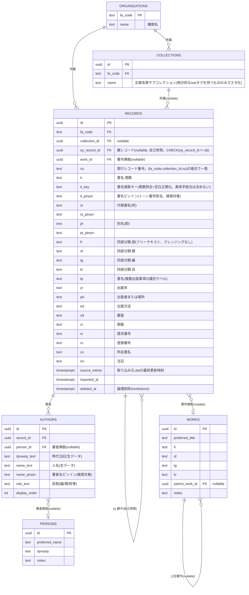

# spec: kanseki-supabase（データ保存サーバー）

- 由来: `docs/全体まとめ.md`（全国漢籍データベース再開発プロジェクト）Part II・III・IV の決定事項を、実装リポジトリ`kanseki-supabase`向けに抽出・整理したもの
- 本ファイルの位置づけ: spec駆動開発の起点となる要件+設計の一体化文書。実装リポジトリ作成時にそちらへ引き継ぐ
- 作成日: 2026-07-11
- 対応する会話ログ: `docs/全体まとめ.md` II-2, II-3, II-4.1, II-5, II-6, III-6, III-7

## 1. このサーバーの役割

「全国漢籍データベース」（82機関・198万件の漢籍書誌データ）の**データ保存・検索インデックス層**。以下の2つの責務を持つ：

1. PostgreSQL + PGroongaによる書誌データの保存・全文検索インデックス提供（`kanseki-app`からKyselyで直接接続される）
2. レガシーシステム（db-sparc）が生成する`tagged/*.dat`を読み取り専用ソースとする**定期ETLインポーター**の実行

## 2. 前提条件・制約

- **少人数（1〜2名）による長期保守**が前提。運用ミドルウェアの種類を増やさないこと、JavaScript/TypeScriptに統一することを優先する
- JavaScriptランタイム、パッケージ管理、スクリプト実行、テストには**Bun**を使用する。`bun.lock`をリポジトリで管理し、npm・pnpm・Yarnのロックファイルを併用しない
- ホスティングは**学内オンプレミス、単独のLinuxサーバー**（`kanseki-app`とは別サーバー）
- self-hosted Supabase（`supabase/postgres`公式Dockerイメージ利用を想定）
- タイムライン: 緊急、1年以内目途（SPARC/OpenText Patの障害リスクのため）
- レガシーの機関データ投入フロー（Kanseki Editor → `maker1`/`maker2` → `tagged/*.dat`）自体は**変更しない**。本サーバーは`tagged/*.dat`を読み取り専用ソースとして扱う

## 3. ネットワーク・アクセス制御

- **決定（2026-07-11）**: `kanseki-app`サーバーとは**同一学内プライベートセグメント**に配置し、PostgreSQLの`pg_hba.conf`とOSファイアウォールで**`kanseki-app`サーバーのIPからの接続のみ許可**する
- VPNソフトウェアは追加運用負荷を避けるため不採用
- 公開ネットワークから本サーバーのDBポートへ直接到達可能な経路は設けない（DBへのアクセスは`kanseki-app`経由のみ）

## 4. スキーマ設計

### 4.1 層構成

1. **中核層**（現行`tagged/*.dat`をほぼそのまま移植）: `RECORDS`, `AUTHORS`, `ORGANIZATIONS`, `COLLECTIONS`
2. **典拠層**（当初は空でよい、後から段階的に紐付け）: `WORKS`（著作典拠）, `PERSONS`（著者典拠）
3. **検索支援層**: `variant_characters`（異体字・簡体字統合、PGroonga `NormalizerTable`用）

### 4.2 ER図



### 4.3 自然キー・スコープに関する注意

- `nu`は機関全体でユニークとは限らない。`catalldat`が1機関内の複数サブコレクション（`tagged`, `taggedHashimoto`等）を1つの`alldat`に結合するため、サブコレクションをまたいで`nu`が衝突しうる
- **正しい自然キーは`(fa_code, collection_id, nu)`の複合キー**。`oy_record_id`もこのスコープ内でのみ解決する
- `RECORDS`に`CHECK (oy_record_id != id)`制約を追加し、自己参照バグ（実データで実例確認済み、`FA007739/tagged/01103010.dat`）を防止する
- 叢書の親子構造(`oy`/`ko`)は最大6階層の実データを確認済み。階層数に上限を設けた設計にしない

### 4.4 各テーブルの移行時点での状態

| テーブル | 状態 |
|---|---|
| `ORGANIZATIONS` | 現行`data/FA*/organization`から機械的に生成。82機関分を1回で投入。初日から完全 |
| `COLLECTIONS` | 現行`maker2`が明示的に`<se>`タグとして定義しているサブコレクションのみをマスタ化。曖昧な区分は機関直下として扱う |
| `RECORDS` | 現行`tagged/*.dat`からほぼ1:1で機械的に移行。`oy`文字列参照は`oy_record_id`という実際の外部キーに変換。初日から完全 |
| `AUTHORS` | 現行`<au>`タグの位置的構造（時代/人名/役割）を解析して機械的に分離。`person_id`は当初すべてNULL |
| `WORKS` | 取込み時に同一`ti_key`を持つ`RECORDS`を自動仮グルーピングするのみ。手作業による名寄せはフェーズ1では実施しない |
| `PERSONS` | 当初は空。`AUTHORS`の生データのみで運用開始 |

### 4.5 分類データ(`fi`/`sf`/`tg`/`ki`)の扱い

実データ集計により単一の統制語彙表が存在しないと判明（`fi`だけで2,819種、上位6値で約94%）。**フェーズ1では全てフリーテキスト(`text`型)のまま移行し、クレンジング・正規化層は設けない**。外部キーやenum制約は設けない。

## 5. 異体字・簡体字検索（`variant_characters` + PGroonga NormalizerTable）

### 5.1 方針

PGroonga自体に繁簡変換の専用機能はないが、`CREATE INDEX USING pgroonga`の`normalizers`オプションに、任意のテーブルを正規化マッピングとして使える`NormalizerTable`機能がある。これを使い、異体字統合を「代表字への正規化」としてインデックス定義に宣言的に組み込む（アプリ層でのクエリOR展開は不要）。

参考: https://pgroonga.github.io/ja/reference/create-index-using-pgroonga.html

### 5.2 テーブル定義

```sql
CREATE TABLE variant_characters (
    target      text NOT NULL,  -- 変換元の1文字（異体字・簡体字）
    normalized  text NOT NULL,  -- 正規化後の代表字（書誌データの表記慣行に合わせ繁体字/正字）
    source      text NOT NULL   -- 'univariants' | 'opencc'
);

CREATE INDEX pgrn_variant_characters_index
    ON variant_characters USING pgroonga
    (target pgroonga_text_term_search_ops_v2, normalized);
```

- `target`→`normalized`は片方向・多対1でよい（逆方向の恒等マッピングは不要）
- データ投入元: `UniVariants`（レガシー資産、8,814件、書誌学的異体字・旧字体表記に強い）＋ OpenCC単字変換表（`STCharacters.txt`/`TSCharacters.txt`等、簡体字⇔繁体字の網羅性に強い）。同一`target`で代表字が食い違う場合は`univariants`由来を優先
- フェーズ1は単字ベースのみ。OpenCCのフレーズレベル変換表は将来課題として保留

### 5.3 検索対象カラムへの適用例

```sql
CREATE INDEX pgroonga_records_ti_index ON records USING pgroonga (ti) WITH (normalizers='
    NormalizerNFKC130,
    NormalizerTable(
        "normalized", "${table:public.pgrn_variant_characters_index}.normalized",
        "target", "target"
    )
');
```

- **運用上の制約**: `variant_characters`を更新した場合、対象インデックスに`REINDEX INDEX`が必須。198万件規模での所要時間は実装フェーズで実測する
- 同様のインデックスを`st`/`pt`/`AUTHORS.name_text`等、検索対象となる他のテキストカラムにも適用する

## 6. ETLインポーター

### 6.1 現行パイプラインとの接続点

- 現行パイプラインは機関ごとに`tagged/*.dat`（1レコード1ファイル）を生成し、`catalldat`が`alldat`に集約する
- 本インポーターは`tagged/*.dat`を読み取り専用のソースとして扱う
- **重要（2026-07-11訂正）**: `tagged/*.dat`はタグ構造こそ機関を問わず統一されているが、**非ASCII文字は依然として「半角スペース＋16進コードポイント」表記のASCIIテキストのまま**であり、UTF-8化はされていない。インポーターは`bin/makeutf8`相当のデコード処理を自前実装する必要がある（アルゴリズムは単純: 正規表現` 2?[0-9a-f]{4}`でスペース+4桁、先頭が"2"の場合のみ5桁の16進コードを検出しUTF-8バイト列に変換するだけ。詳細は`docs/全体まとめ.md` II-6.1節、原型は`survey/bin/makeutf8`）
- FA011962（`orig`/`origKuraishi`、Big5・`tag:value`形式の独立パイプライン）は**フェーズ1ではスコープ外**。標準のXML類似タグ形式`tagged/*.dat`のみを対象とする

### 6.2 実行方式

| 論点 | 決定 |
|---|---|
| 実行場所 | 本サーバー（Supabaseサーバー）側で実行。rsync取得からDB書き込みまでを同一マシンで完結させる |
| 実行頻度 | 日次バッチ。`.dat`の更新有無に関わらず定時実行（差分がなければ何もしない） |
| ソースファイルへのアクセス方法 | rsync定期同期。db-sparcへの直接マウントは避ける |
| 差分検出 | rsyncの転送結果を利用（`--itemize-changes`等で実際に転送されたファイル一覧を取得し、それのみをDB処理対象とする）。独自のmtime比較ロジックは実装しない |
| 削除の検出・反映 | **論理削除のみ**（`deleted_at`をセット、物理削除はしない）。`oy_record_id`の自己参照FKにより他レコードから参照されている可能性があるため、物理削除は参照整合性を壊すリスクがある |
| oy/ko整合性・投入順序 | **2パス投入**。パス1: 全レコードを`oy_record_id=NULL`のままINSERT。パス2: `oy`タグの文字列参照を`(fa_code, collection_id, nu)`複合キーで解決し、実際の`oy_record_id`へUPDATE。ファイルの投入順序に依存しない。自己参照は`CHECK`制約で防止、一般的な循環参照はパス2のUPDATE時にインポーター側で検出しスキップ・警告する |
| WORKS自動グルーピング | 取込み時に`ti_key`（巻数除去＋空白正規化、異体字統合は含めない）が一致する`RECORDS`を仮グルーピング |
| 取り込み失敗時の扱い | 一部機関のデータ不整合時は**当該機関のみスキップし他機関の取り込みは継続**。能動的な通知は行わず、運用ダッシュボード（6.3節）で確認する |

### 6.3 運用ダッシュボード

- 定期インポーターの成功/失敗、最新取り込み日時、機関ごとのエラー有無を確認できる軽量なページ
- 認証は本格的なユーザー管理ではなく**学内キャンパスIP制限**で十分
- 能動的な障害通知（メール等）は行わない
- 典拠層（`WORKS`/`PERSONS`）の名寄せ・紐づけ作業は当面SQL直接操作。将来的な「簡易な紐づけUI」追加を妨げない疎結合な設計を維持する
- このダッシュボードの実装場所（本サーバー上の独立UIか、`kanseki-app`側の管理画面か）は実装フェーズで確定する（現時点では未決定）

## 7. 検索エンジン

- **PostgreSQL + PGroonga**。n-gram(bigram)方式がデフォルトでCJKに強く、レガシーOpenText Patの文字単位インデックスと挙動が近い
- PGroongaはSupabase公式サポート拡張（`supabase.com/docs/guides/database/extensions/pgroonga`）。self-hostedでも同一の`supabase/postgres`Dockerイメージで`CREATE EXTENSION pgroonga;`により有効化できる見込み。**自前ホスト環境での最終動作確認は実装フェーズで行う**（未検証）
- ピンイン検索: `ti_pinyin`/`st_pinyin`/`pt_pinyin`/`AUTHORS.name_pinyin`はソースの`TI`/`ST`/`PT`/`AU`大文字タグ（ピンイン）から抽出し、トーン番号を除去した正規化列として保持・索引化する。トーン番号を無視した緩い一致とする

## 8. スコープ外・未決定事項

- 横断検索（四庫全書提要DB等との統合）は今回のスコープ外
- バックアップ・リストア方針は**未検討**。実装フェーズで別途設計が必要
- 運用ダッシュボードの実装場所（本サーバー内か`kanseki-app`側か）
- REINDEX所要時間の実測、および`variant_characters`更新の運用フロー（頻度・承認プロセス）

## 9. 開発基盤の受け入れ基準

- `bun install`で依存関係を再現できる
- `bun test`で自動テストを実行できる
- `bun run lint`および`bun run typecheck`で静的検査を実行できる
- npm・pnpm・Yarnのロックファイルが存在しない
- READMEを含むリポジトリ文書とコードコメントは日本語で記述し、開発コマンドはBunに統一する
